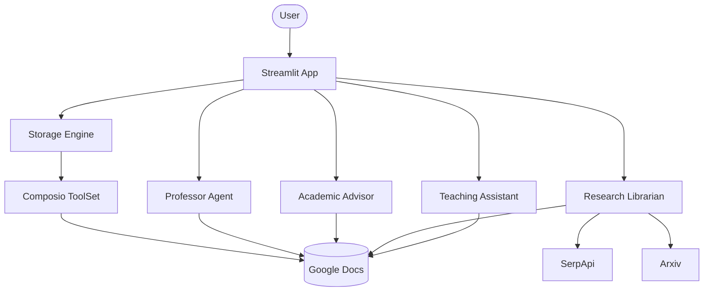

# 👨‍🏫 AI Teaching Agent Team with Agno & Composio

A sophisticated multi-agent learning platform that researches any topic, designs a roadmap, curates resources, and creates practice materials—all automatically stored in Google Docs.

## 🌟 Features

- **Expert Team**: Specialized agents for Research (Professor), Learning Paths (Advisor), Resources (Librarian), and Practice (TA).
- **Google Docs Integration**: Powered by Composio to generate structured study materials directly in your cloud storage.
- **Academic Depth**: Integrated with Arxiv for the latest research papers and SerpApi for real-world resources.
- **Interactive UI**: Modern Streamlit interface with topic history, progress tracking, and direct document link cards.
- **Modular Architecture**: Clean separation of agent configurations, storage engines, and UI logic.

## 🏗️ Architecture



## 🛠️ Quick Start

1. **Clone & Install**:

   ```bash
   git clone https://github.com/hamzach9410/LLM-PROJECTS-PACK.git
   cd advanced_ai_agents/multi_agent_apps/agent_teams/ai_teaching_agent_team
   pip install -r requirements.txt
   ```

2. **Configure API Keys**:
   Create a `.env` file or use the sidebar in the app for:
   - `OPENAI_API_KEY`
   - `COMPOSIO_API_KEY`
   - `SERPAPI_API_KEY`

3. **Run the App**:
   ```bash
   streamlit run app.py
   ```

## 🚀 20 Contributions

This project has been transformed with 20 professional contributions including full modularization, enhanced Agent instructions, Arxiv integration, and a major UI/UX overhaul.
