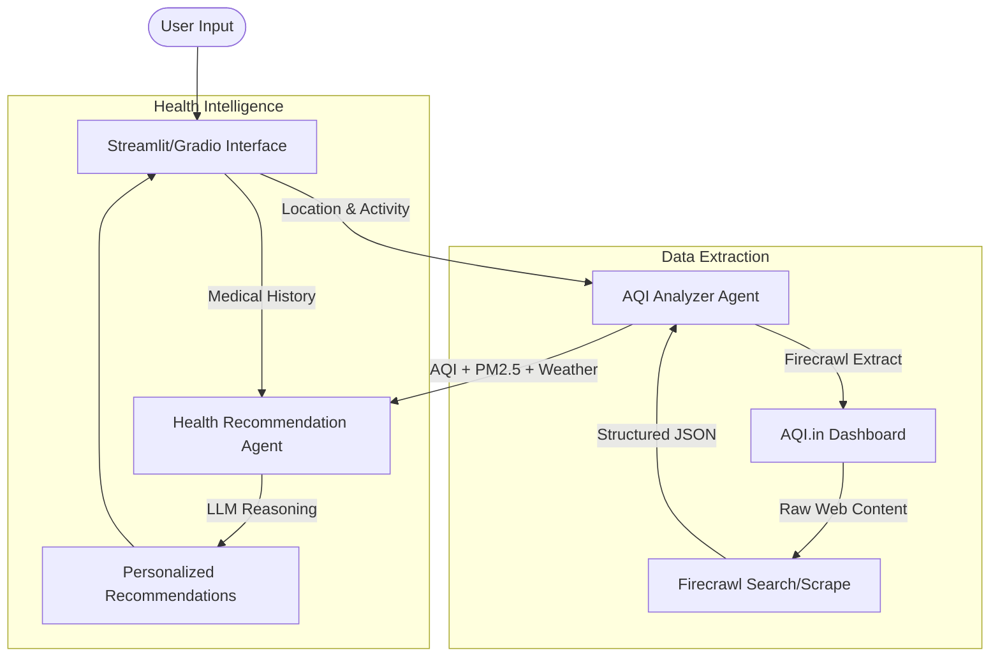

# 🌍 AQI Analysis Agent: Multi-Agent Air Quality Intelligence

Developed by **Ali Hamza** | AI/ML/DL Engineer

[](https://www.linkedin.com/in/ali-hamza-ai-ml-dl-engineer/)
[](mailto:ihamzaali06@gmail.com)

---

### 🎓 FREE Step-by-Step Tutorial

**👉 [Click here to follow our complete step-by-step tutorial](https://www.theunwindai.com/p/build-an-aqi-analysis-agent) and learn how to build this from scratch with detailed code walkthroughs, explanations, and best practices.**

---

## 📌 Overview

The **AQI Analysis Agent** is a sophisticated multi-agent system designed for real-time air quality monitoring and personalized health advisory. Built using the **Agno Agent Framework** and **Firecrawl**, it bridges the gap between raw atmospheric data and actionable health insights by analyzing local pollutants and weather conditions against a user's specific medical context and planned activities.

## 🏗️ Architecture

The system employs a coordinated workflow between specialized agents and high-performance data extraction tools:



## 🤖 Agent Roles

1.  **AQI Analyzer (Data Specialist)**:
    - **Goal**: Fetch and structure real-time air quality data.
    - **Tools**: Firecrawl Extract (LLM-powered scraping).
    - **Logic**: Dynamically formats URLs for thousands of cities globally and extracts PM2.5, PM10, CO, and weather metrics.

2.  **Health Recommender (Medical Reasoning)**:
    - **Goal**: Translate environmental risk into activity-safe advice.
    - **Model**: GPT-4o.
    - **Logic**: Correlates AQI levels with user-provided medical conditions (e.g., Asthma, COPD) to provide "Go/No-Go" decisions for outdoor activities.

## ✨ Features

- **Real-time extraction** of 7+ environmental metrics (AQI, PM2.5, PM10, CO, Temp, Humidity, Wind).
- **Dynamic URL routing** supporting global locations (City, State, Country).
- **Medical context awareness** for tailored safety advice.
- **Dual Interface Support**: Use either **Streamlit** (for complex reports) or **Gradio** (for simple chat-like analysis).
- **Portable JSON output** and downloadable recommendation reports.

## 🚀 Getting Started

### 1. Installation

```bash
# Clone the repository
git clone https://github.com/hamzach9410/LLM-PROJECTS-PACK.git
cd advanced_ai_agents/multi_agent_apps/ai_aqi_analysis_agent

# Install dependencies
pip install -r requirements.txt
```

### 2. Configuration

You will need the following API keys:

- **OpenAI API Key**: For agent reasoning. [Get it here](https://platform.openai.com/).
- **Firecrawl API Key**: For web extraction. [Get it here](https://firecrawl.dev/).

### 3. Running the Application

Choose your preferred interface:

**Option A: Streamlit (Recommended for full reports)**

```bash
streamlit run ai_aqi_analysis_agent_streamlit.py
```

**Option B: Gradio (Simple web interface)**

```bash
python ai_aqi_analysis_agent_gradio.py
```

## 📁 Project Structure

```text
ai_aqi_analysis_agent/
├── ai_aqi_analysis_agent_streamlit.py  # Streamlit UI & Core Logic
├── ai_aqi_analysis_agent_gradio.py     # Gradio Interface Version
├── requirements.txt                    # Project Dependencies
└── README.md                           # Documentation
```

## ⚠️ Important Note

Air quality data is extracted via web scraping of live dashboards. While highly effective, results may occasionally reflect cached values from the source website. For mission-critical decisions, always cross-reference with official local sensors.

---

_Built with ❤️ for a healthier future._
