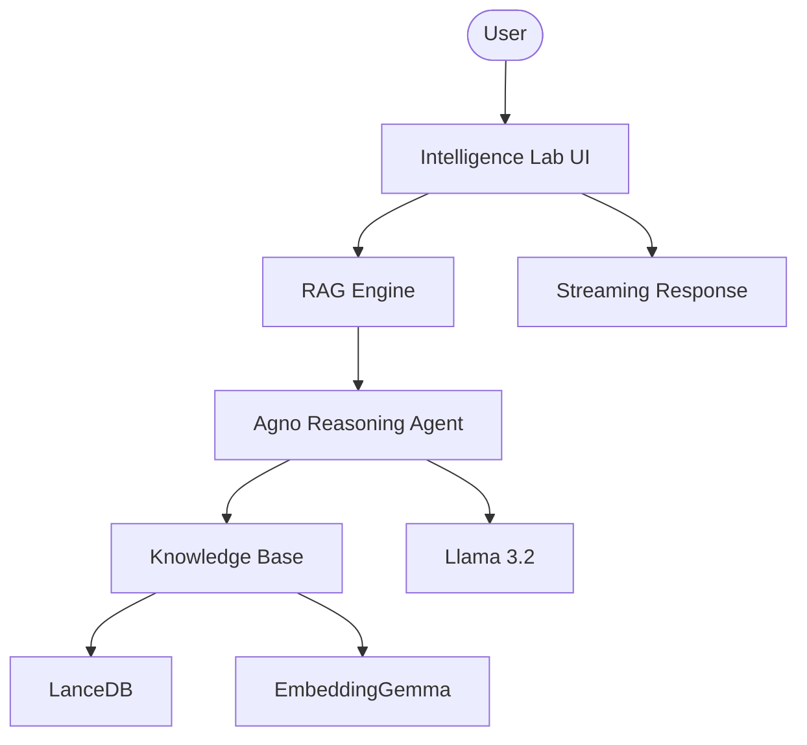

# 🔥 Agentic RAG Intelligence Lab (Gemma)

A professional-grade local RAG platform. Built with Agno and Google's EmbeddingGemma, this platform enables high-precision document intelligence and semantic search, all running privately on your local machine via Ollama.

## 🌟 Features

- **100% Local Intelligence**: Uses EmbeddingGemma for vector embeddings and Llama 3.2 for reasoning.
- **Agentic Knowledge Retrieval**: Specialized agents autonomously select the best context for answering queries.
- **Dynamic Ingestion**: Add PDF URLs on the fly to expand your private knowledge base.
- **High-Performance Vector Store**: Powered by LanceDB for efficient local similarity search.
- **Premium UI**: Modern Streamlit interface with real-time indexing status and streaming responses.

## 🏗️ Architecture



## 🛠️ Quick Start

1. **Prerequisites**:
   Install [Ollama](https://ollama.com/) and pull the models:

   ```bash
   ollama pull embeddinggemma:latest
   ollama pull llama3.2:latest
   ```

2. **Clone & Install**:

   ```bash
   git clone https://github.com/hamzach9410/LLM-PROJECTS-PACK.git
   cd rag_tutorials/agentic_rag_embedding_gemma
   pip install -r requirements.txt
   ```

3. **Run the Lab**:
   ```bash
   streamlit run app.py
   ```

## 📦 Project Structure

- `app.py`: Main interactive intelligence dashboard.
- `agents_config.py`: Configuration for Knowledge Base and Reasoning Agents.
- `rag_engine.py`: Core logic for document ingestion and agentic querying.
- `utils.py`: UI styling and session management.

## 🚀 Professional Modernization

This project has been transformed from a single-script tutorial into a comprehensive local intelligence platform with a focus on modularity, high-fidelity embeddings, and private-first data processing.
