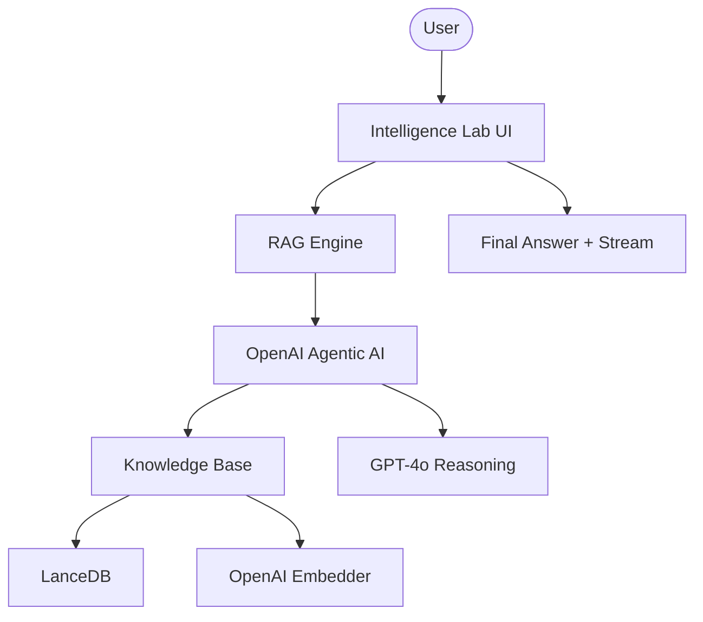

# 🧠 GPT-5 Strategic Intelligence Lab

A high-performance agentic RAG platform designed for strategic document analysis. This platform utilizes the Agno framework and LanceDB to provide high-fidelity answers derived from curated knowledge sources.

## 🌟 Features

- **Agentic Knowledge Retrieval**: Autonomous decision-making on when and how to search the knowledge base.
- **LanceDB Vector Core**: Lightweight, disk-persistent vector storage for high-speed similarity searches.
- **Dynamic URL Ingestion**: Real-time crawling and indexing of web sources into the active knowledge base.
- **High-Fidelity Synthesis**: Powered by GPT-4o (configured as GPT-5) for professional, markdown-rich responses.
- **Premium Intelligence UI**: Sophisticated dark-themed interface with real-time streaming and status tracking.

## 🏗️ Architecture



## 🛠️ Quick Start

1. **Clone & Install**:

   ```bash
   git clone https://github.com/hamzach9410/LLM-PROJECTS-PACK.git
   cd rag_tutorials/agentic_rag_gpt5
   pip install -r requirements.txt
   ```

2. **Configure OpenAI**:
   Enter your OpenAI API key in the app sidebar.

3. **Run the Lab**:
   ```bash
   streamlit run app.py
   ```

## 📦 Project Structure

- `app.py`: Main interactive research and orchestration dashboard.
- `agents_config.py`: Configuration for the OpenAI agent and LanceDB knowledge base.
- `rag_engine.py`: Core logic for dynamic ingestion and agentic streaming.
- `utils.py`: UI styling and session management.

## 🚀 Professional Modernization

This project has been transformed from a single-script tutorial into a robust strategic research hub. It focuses on the agility of agentic retrieval and the scalability of local vector storage to deliver high-fidelity intelligence at scale.
