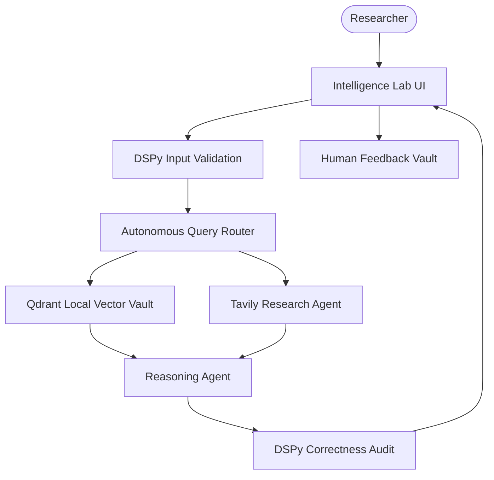

# 🧮 Global Math Intelligence & Research Lab

A high-performance agentic RAG platform engineered for advanced mathematical reasoning and strategic proof synthesis. This system specializes in solving JEE-level competitive mathematics using a robust multi-agent architecture with autonomous routing, DSPy-powered guardrails, and human-in-the-loop refinement.

## 🌟 Features

- **Agentic Proof Synthesis**: Generates rigorous, step-by-step mathematical solutions using GPT-4o-level reasoning.
- **Autonomous Knowledge Routing**: Intelligently switches between a specialized Qdrant vector vault (JEEBench) and Tavily web research.
- **DSPy Guardrails**: Implements strict input/output validation to ensure mathematical accuracy and academic relevance.
- **Human-in-the-Loop Feedback**: Integrated feedback loop for recording user ratings and refining reasoning pathways.
- **Performance Benchmarking**: Built-in audit tools to evaluate accuracy against the standardized JEEBench dataset.
- **Premium Research UI**: Sophisticated multi-tab Streamlit dashboard for research orchestration and data visualization.

## 🏗️ Architecture



## 🛠️ Quick Start

1. **API Setup**:
   Obtain API keys from [OpenAI](https://platform.openai.com/) and [Tavily](https://tavily.com/).

2. **Clone & Install**:

   ```bash
   git clone https://github.com/hamzach9410/LLM-PROJECTS-PACK.git
   cd rag_tutorials/agentic_rag_math_agent
   pip install -r requirements.txt
   ```

3. **Initialize Lab**:
   Configure your `.env` file with the required keys.

4. **Run the Lab**:
   ```bash
   streamlit run app.py
   ```

## 📦 Project Structure

- `app.py`: Main interactive research and orchestration dashboard.
- `rag/`: Core logic for query routing, mathematical reasoning, and knowledge retrieval.
- `app/`: Specialized modules for benchmarking and data loading.
- `logs/`: Persisted intelligence fragments and user feedback logs.

## 🚀 Professional Modernization

This project has been transformed from a foundation tutorial into a robust mathematical research lab. It focuses on the convergence of symbolic reasoning and retrieval-augmented generation to deliver a high-fidelity platform for technical education and analytical research.
