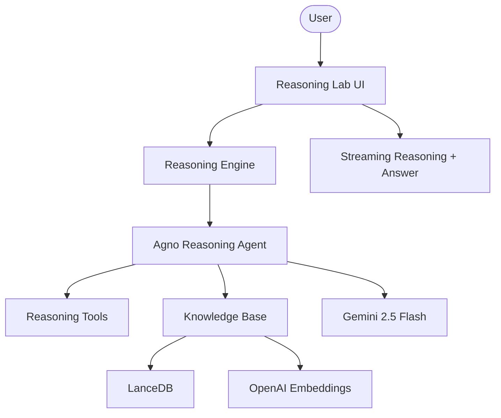

# 🧐 Agentic Reasoning RAG Hub

A professional-grade RAG platform that combines deep step-by-step reasoning with modular knowledge retrieval. Built with Agno, Google Gemini, and OpenAI, this platform analyzes complex information and provides synthesized answers with verifiable citations.

## 🌟 Features

- **Step-by-Step Reasoning**: Leverages `ReasoningTools` to think through complex queries before providing a final answer.
- **Agentic Knowledge Retrieval**: Autonomously searches and retrieves context from indexed URLs and documents.
- **Multi-Model Intelligence**: Uses Google Gemini for reasoning and OpenAI for high-fidelity semantic embeddings.
- **Streaming Logic**: Real-time visibility into the agent's reasoning process and final answer generation.
- **Verifiable Citations**: Automatically extracts and displays sources used in the reasoning process.

## 🏗️ Architecture



## 🛠️ Quick Start

1. **Clone & Install**:

   ```bash
   git clone https://github.com/hamzach9410/LLM-PROJECTS-PACK.git
   cd rag_tutorials/agentic_rag_with_reasoning
   pip install -r requirements.txt
   ```

2. **Configure API Keys**:
   Create a `.env` file or use the sidebar:

   ```env
   GOOGLE_API_KEY=your_google_key
   OPENAI_API_KEY=your_openai_key
   ```

3. **Run the Hub**:
   ```bash
   streamlit run app.py
   ```

## 📦 Project Structure

- `app.py`: Main interactive reasoning dashboard.
- `agents_config.py`: Configuration for Knowledge Base and Reasoning Agents.
- `rag_engine.py`: Core logic for source ingestion and reasoning orchestration.
- `utils.py`: UI styling and session management.

## 🚀 Professional Modernization

This project has been transformed from a single-script tutorial into a comprehensive reasoning intelligence platform with a focus on modularity, transparent AI thinking, and high-fidelity research integration.
