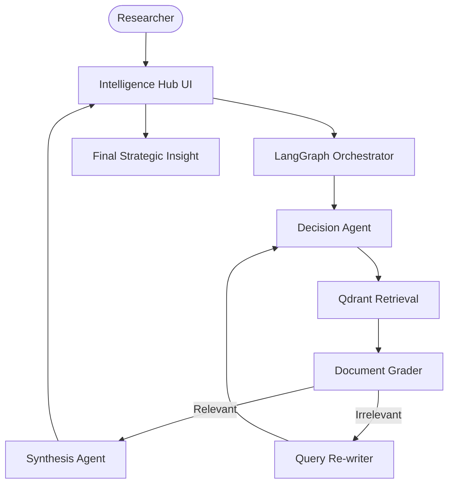

# 🔍 AI Strategic Blog Intelligence Hub

A professional-grade agentic RAG platform designed for strategic analysis of AI research blogs. Built with LangGraph, Qdrant, and Gemini 2.0 Flash, this platform implements a self-correcting RAG loop that dynamically evaluates document relevance and rewrites queries for optimal retrieval.

## 🌟 Features

- **Self-Correcting RAG Flow**: Uses LangGraph to orchestrate a feedback loop that grades retrieved documents and re-plans searches if initial results are irrelevant.
- **Strategic Blog Ingestion**: Real-time crawling and semantic fragmenting of technical AI blogs into a specialized Qdrant vault.
- **Gemini 2.0 Flash Reasoning**: High-speed, high-fidelity synthesis of complex research content.
- **Qdrant Vector Cluster**: Industrial-ready vector storage for high-fidelity document retrieval.
- **Enterprise Graph Logic**: Specialized node and edge definitions for document grading, query rewriting, and final synthesis.

## 🏗️ Architecture



## 🛠️ Quick Start

1. **API Infrastructure**:
   Obtain API keys from [Google AI Studio](https://aistudio.google.com/) and [Qdrant Cloud](https://cloud.qdrant.io/).

2. **Clone & Install**:

   ```bash
   git clone https://github.com/hamzach9410/LLM-PROJECTS-PACK.git
   cd rag_tutorials/ai_blog_search
   pip install -r requirements.txt
   ```

3. **Synchronize Hub**:
   Provide your research cluster credentials in the laboratory sidebar.

4. **Run the Hub**:
   ```bash
   streamlit run app.py
   ```

## 📦 Project Structure

- `app.py`: Main interactive research orchestration dashboard.
- `graph_logic.py`: Core LangGraph definitions for nodes, edges, and agentic workflows.
- `vector_store.py`: Logic for AI blog crawling and Qdrant cluster management.
- `rag_config.py`: Configuration for Gemini models and research cluster settings.
- `utils.py`: Modern research lab aesthetics and session management.

## 🚀 Professional Modernization

This project has been transformed from a foundation tutorial into a robust strategic intelligence hub. It focuses on the agility of agentic orchestrations to provide a self-correcting RAG platform for high-stakes technical research.
