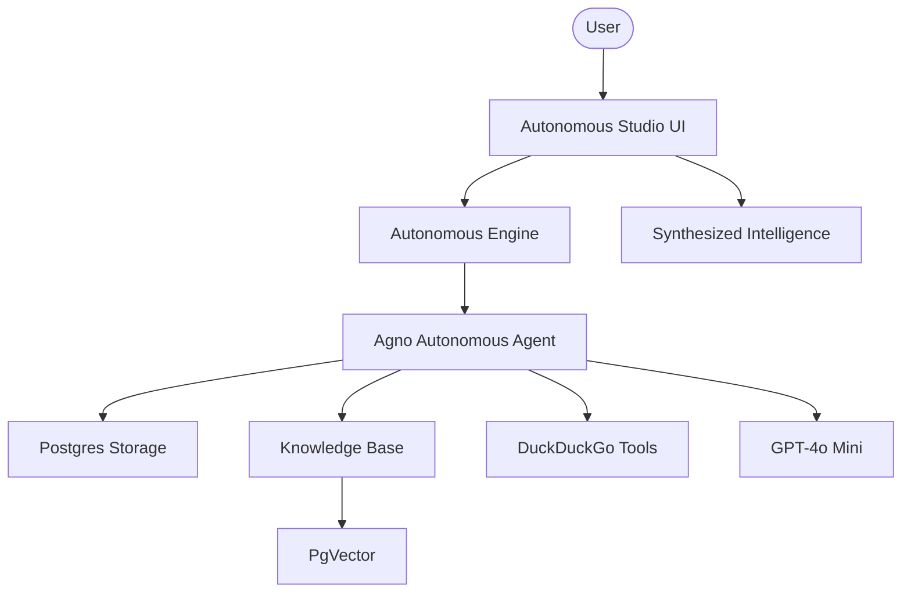

# 🤖 Autonomous RAG Intelligence Studio

A production-grade Autonomous RAG platform. Built with Agno, OpenAI, and PostgreSQL (PgVector), this platform intelligently orchestrates between private document knowledge and global web intelligence to provide comprehensive answers.

## 🌟 Features

- **Autonomous Orchestration**: Specialized agent intelligently decides when to use internal knowledge vs. performing a web search.
- **Persistent Memory**: Uses `PostgresAgentStorage` to keep track of conversations across sessions.
- **Scalable Vector Database**: Leverages `PgVector` for high-performance similarity search within a PostgreSQL environment.
- **Dual-Mode Intelligence**: Combines private PDF knowledge with real-time DuckDuckGo web search.
- **Professional Diagnostic UI**: Modern Streamlit interface with real-time execution status and infrastructure tracking.

## 🏗️ Architecture



## 🛠️ Quick Start

1. **Infrastructure**:
   Ensure a PostgreSQL database with PgVector is running (default: `localhost:5532`).

2. **Clone & Install**:

   ```bash
   git clone https://github.com/hamzach9410/LLM-PROJECTS-PACK.git
   cd rag_tutorials/autonomous_rag
   pip install -r requirements.txt
   ```

3. **Configure API Key**:
   Create a `.env` file or use the sidebar:

   ```env
   OPENAI_API_KEY=your_openai_key
   DATABASE_URL=postgresql+psycopg://ai:ai@localhost:5532/ai
   ```

4. **Run the Studio**:
   ```bash
   streamlit run app.py
   ```

## 📦 Project Structure

- `app.py`: Main interactive autonomous dashboard.
- `agents_config.py`: Configuration for Agent personas, Knowledge Base, and SQL Storage.
- `rag_engine.py`: Core logic for multi-modal ingestion and orchestration.
- `utils.py`: Database helpers and UI styling.

## 🚀 Professional Modernization

This project has been transformed from a single-script tutorial into a robust autonomous intelligence studio with a focus on database persistence, scalable search, and production-ready RAG orchestration.
