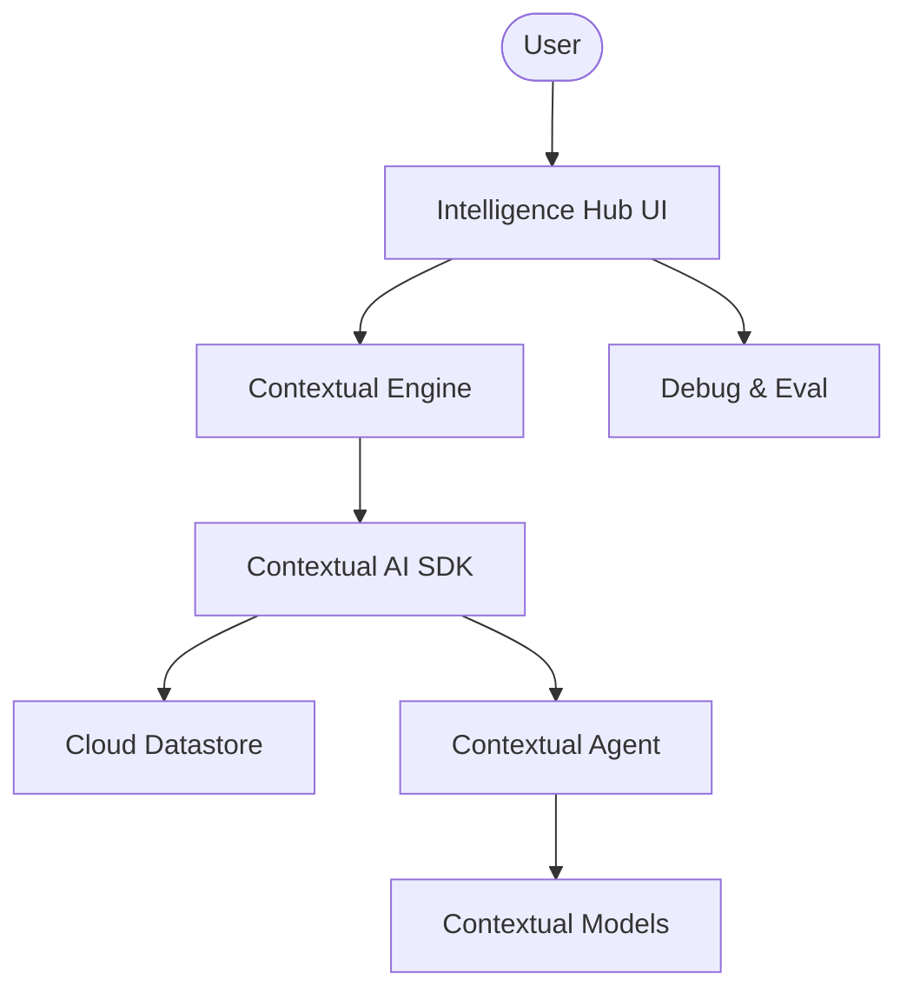

# 🧬 Contextual AI Intelligence Hub

A professional-grade RAG platform powered by the Contextual AI SDK. This platform offers seamless datastore management, document ingestion, and agent orchestration for high-fidelity contextual intelligence.

## 🌟 Features

- **SDK-Powered Orchestration**: Full integration with the Contextual AI platform for robust agent management.
- **Dynamic Infrastructure**: Create and manage datastores and agents directly from the UI.
- **Multi-Modal Document Ingestion**: Supports high-fidelity ingestion of PDFs and TXT files with custom metadata.
- **Advanced Diagnostics**: Inspect raw retrieval data and evaluate agent performance using built-in diagnostic tools.
- **Premium Chat Interface**: Modern Streamlit interface with clean session management and formatted responses.

## 🏗️ Architecture



## 🛠️ Quick Start

1. **Clone & Install**:

   ```bash
   git clone https://github.com/hamzach9410/LLM-PROJECTS-PACK.git
   cd rag_tutorials/contextualai_rag_agent
   pip install -r requirements.txt
   ```

2. **Configure API Key**:
   Create a `.env` file or use the sidebar:

   ```env
   CONTEXTUAL_API_KEY=your_key
   BASE_URL=https://api.contextual.ai/v1
   ```

3. **Run the Hub**:
   ```bash
   streamlit run app.py
   ```

## 📦 Project Structure

- `app.py`: Main interactive deployment and chat dashboard.
- `agents_config.py`: Configuration for Contextual AI client and verification.
- `rag_engine.py`: Core logic for infrastructure management and querying.
- `utils.py`: UI styling and session management.

## 🚀 Professional Modernization

This project has been transformed from a single-script tutorial into a comprehensive contextual intelligence hub with a focus on modular infrastructure, scalable document management, and developer-centric diagnostics.
