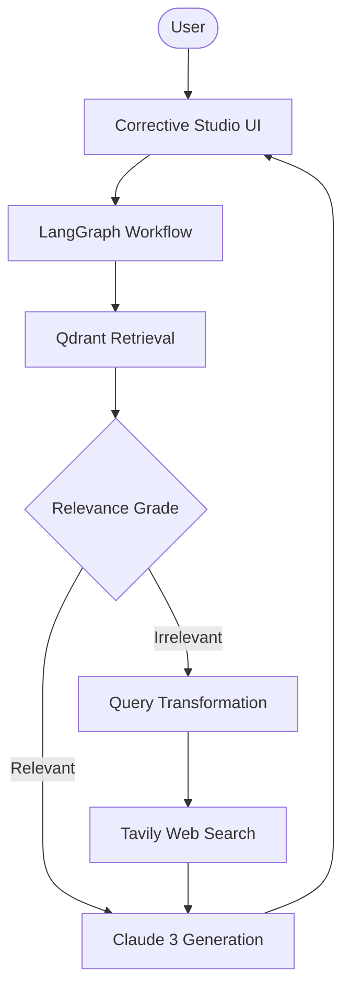

# 🔄 Corrective RAG Intelligence Studio

A high-fidelity RAG platform that implements **Corrective Retrieval-Augmented Generation (CRAG)** using LangGraph. This platform evaluates the quality of retrieved documents and autonomously triggers web searches (via Tavily) if the internal knowledge is insufficient.

## 🌟 Features

- **Self-Correcting Workflow**: Uses `LangGraph` to implement a multi-step pipeline (Retrieve -> Grade -> Transform -> Search -> Generate).
- **Document Grading**: Intelligent relevance scoring of retrieved documents to filter out noise.
- **Autonomous Web Fallback**: Triggers Tavily search if the vector store fails to provide relevant context.
- **Multi-Cloud Intelligence**: Combines OpenAI embeddings with Anthropic Claude 3 for superior reasoning.
- **Professional Scalability**: Powered by Qdrant vector database for high-performance similarity search.

## 🏗️ Architecture



## 🛠️ Quick Start

1. **Infrastructure**:
   Ensure [Qdrant](https://qdrant.tech/) is running (default: `localhost:6333`).

2. **Clone & Install**:

   ```bash
   git clone https://github.com/hamzach9410/LLM-PROJECTS-PACK.git
   cd rag_tutorials/corrective_rag
   pip install -r requirements.txt
   ```

3. **Configure API Keys**:
   Create a `.env` file or use the sidebar:

   ```env
   OPENAI_API_KEY=your_openai_key
   ANTHROPIC_API_KEY=your_anthropic_key
   TAVILY_API_KEY=your_tavily_key
   ```

4. **Run the Studio**:
   ```bash
   streamlit run app.py
   ```

## 📦 Project Structure

- `app.py`: Main interactive graph orchestration dashboard.
- `graph_config.py`: LangGraph workflow definition and node logic.
- `llm_config.py`: Configuration for OpenAI and Anthropic models.
- `vector_store.py`: Qdrant client and collection management.
- `rag_logic.py`: Document loading and external search utilities.

## 🚀 Professional Modernization

This project has been transformed from a single-script tutorial into a robust autonomous research platform. It leverages state-of-the-art graph orchestration for self-correcting intelligence and high-fidelity RAG workflows.
