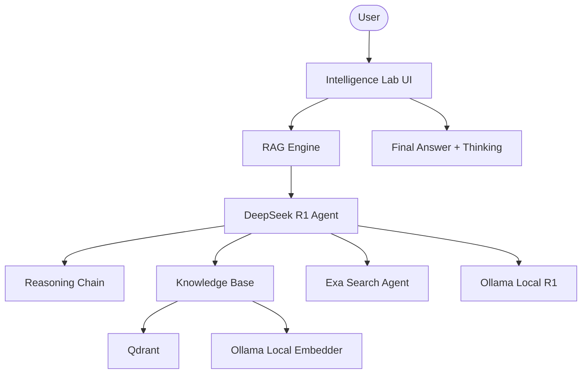

# 🐋 DeepSeek Local Intelligence Lab

A high-performance local RAG platform. Built with Agno, DeepSeek-R1 (via Ollama), and Qdrant, this platform enables transparent AI reasoning and high-fidelity research, all while maintaining data privacy on your local machine.

## 🌟 Features

- **Transparent Local Reasoning**: Exposes DeepSeek-R1's internal `<think>` blocks for verifiable AI logic.
- **Hybrid Search Strategy**: Intelligently switches between local Qdrant vector retrieval and global Exa web search.
- **Ollama-Native Ingestion**: Custom embedding pipeline using local Ollama models (snowflake-arctic-embed).
- **Multi-Source Ingestion**: Unified support for PDF uploads and Web URL indexing.
- **Premium Intelligence UI**: Modern Streamlit interface with dynamic reasoning containers and real-time status tracking.

## 🏗️ Architecture



## 🛠️ Quick Start

1. **Local LLM**:
   Install [Ollama](https://ollama.com/) and pull the models:

   ```bash
   ollama pull deepseek-r1:1.5b
   ollama pull snowflake-arctic-embed
   ```

2. **Clone & Install**:

   ```bash
   git clone https://github.com/hamzach9410/LLM-PROJECTS-PACK.git
   cd rag_tutorials/deepseek_local_rag_agent
   pip install -r requirements.txt
   ```

3. **Configure Settings**:
   Use the sidebar in the app to provide your Qdrant and Exa (optional) credentials.

4. **Run the Lab**:
   ```bash
   streamlit run app.py
   ```

## 📦 Project Structure

- `app.py`: Main interactive reasoning and research hub.
- `agents_config.py`: Configuration for DeepSeek and Web Search agents.
- `rag_engine.py`: Core logic for multi-modal ingestion and RAG querying.
- `vector_store.py`: Qdrant client and custom local embedding wrapper.
- `utils.py`: Response parsing and UI aesthetic helpers.

## 🚀 Professional Modernization

This project has been transformed from a single-script tutorial into a robust local intelligence hub. It focuses on the transparency of LLM thinking, scalable local storage, and the seamless integration of private and public knowledge sources.
