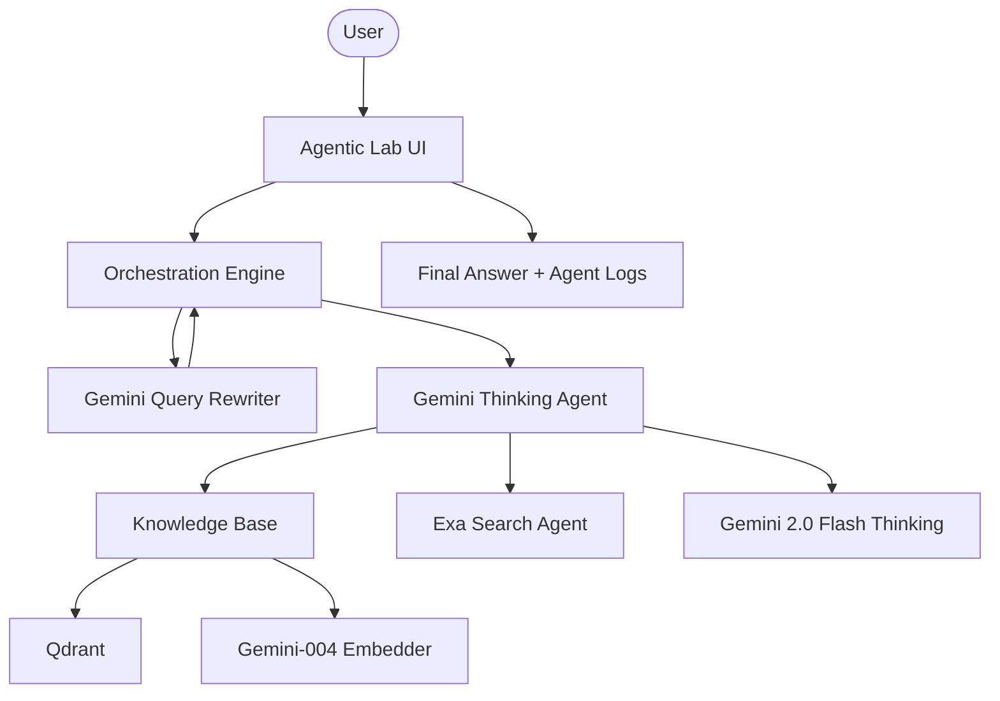

# 🤔 Gemini Agentic RAG Lab

A professional-grade RAG platform driven by Google's Gemini 2.0 Flash Thinking. This platform utilizes a multi-agent orchestration strategy to rewrite queries, autonomously retrieve documents, and synthesize reasoning-rich answers.

## 🌟 Features

- **Multi-Agent Orchestration**: Specialized agents for query reformulation, web search, and final RAG synthesis.
- **Gemini 2.0 Flash Thinking**: Leverages the latest experimental reasoning models for deep contextual analysis.
- **Dynamic Retrieval Fallback**: Inclusively searches local Qdrant vector storage and global Exa web results.
- **High-Fidelity Embedding**: Uses `text-embedding-004` for superior semantic accuracy.
- **Advanced Ingestion**: Seamless processing of PDF documents and web URLs into high-performance vector collections.
- **Diagnostic UI**: Modern Streamlit interface with real-time status updates and query transformation insights.

## 🏗️ Architecture



## 🛠️ Quick Start

1. **Clone & Install**:

   ```bash
   git clone https://github.com/hamzach9410/LLM-PROJECTS-PACK.git
   cd rag_tutorials/gemini_agentic_rag
   pip install -r requirements.txt
   ```

2. **Configure Credentials**:
   Enter your Google, Qdrant, and Exa (optional) API keys in the app sidebar.

3. **Run the Lab**:
   ```bash
   streamlit run app.py
   ```

## 📦 Project Structure

- `app.py`: Main interactive orchestration and research dashboard.
- `agents_config.py`: Definitions for the suite of specialized Gemini agents.
- `rag_engine.py`: Core logic for multi-modal ingestion and agentic RAG flows.
- `vector_store.py`: Qdrant client and Gemini-native embedding logic.
- `utils.py`: UI styling and session management.

## 🚀 Professional Modernization

This project has been transformed from a single-script tutorial into a robust autonomous intelligence hub. It focuses on multi-agent collaboration, high-fidelity reasoning, and the seamless integration of diverse knowledge sources.
