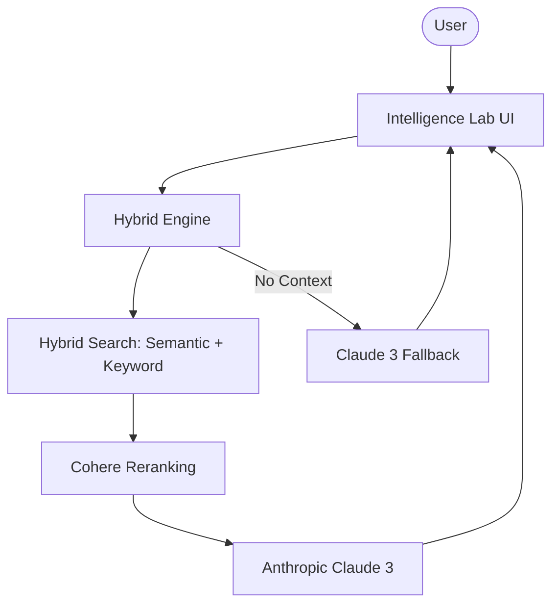

# 👀 Hybrid RAG Intelligence Lab

A high-performance RAG platform that implements **Hybrid (Semantic + Keyword) Search** with advanced reranking. Built with `raglite`, this platform orchestrates intelligence across OpenAI (Embeddings), Anthropic (Reasoning), and Cohere (Reranking) for superior accuracy.

## 🌟 Features

- **Hybrid Retrieval Strategy**: Combines vector similarity with keyword search for maximum recall.
- **Strategic Reranking**: Leverages Cohere's rerank-v3 to ensure the most relevant context is prioritized for the LLM.
- **Multi-Model Orchestration**: Uses OpenAI for strategic embeddings and Anthropic Claude 3 for high-fidelity synthesis.
- **Seamless Fallback Logic**: Intelligently switches to global LLM knowledge if no internal documents are relevant.
- **Professional Scalability**: Powered by `raglite` for efficient document chunking and local storage management.

## 🏗️ Architecture



## 🛠️ Quick Start

1. **Clone & Install**:

   ```bash
   git clone https://github.com/hamzach9410/LLM-PROJECTS-PACK.git
   cd rag_tutorials/hybrid_search_rag
   pip install -r requirements.txt
   ```

2. **Configure Multi-Model Keys**:
   Provide your OpenAI, Anthropic, and Cohere API keys in the app sidebar.

3. **Run the Lab**:
   ```bash
   streamlit run app.py
   ```

## 📦 Project Structure

- `app.py`: Main interactive research and chat dashboard.
- `rag_config.py`: Configuration for `raglite` and environment management.
- `rag_engine.py`: Core logic for ingestion, hybrid search, and RAG execution.
- `utils.py`: Fallback logic and UI aesthetic helpers.

## 🚀 Professional Modernization

This project has been transformed from a single-script tutorial into a comprehensive hybrid intelligence platform. It focuses on the synergy between multiple AI providers to deliver high-fidelity RAG workflows with industrial-grade precision.
