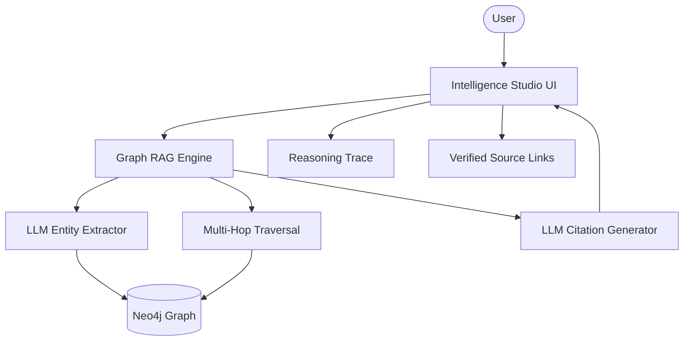

# 🔍 Knowledge Graph Intelligence Studio

A sophisticated RAG platform that utilizes graph-based multi-hop reasoning and verifiable citations. Built with Agno, Neo4j, and Ollama, this platform enables transparent AI analysis by tracing every claim back to connected intelligence nodes.

## 🌟 Features

- **Multi-Hop Reasoning**: Traverses complex relationships in Neo4j to answer questions that require connecting multiple documentation fragments.
- **Verifiable Citations**: Every claim is explicitly tagged with source-level provenance [N].
- **LLM-Based Entity Extraction**: Uses Llama 3.1 to autonomously identify entities and relationships from raw text.
- **Transparent Reasoning Traces**: Real-time diagnostic logs of the graph traversal and lookup process.
- **Strategic Visualization**: Insights into the density and connectivity of the research graph.

## 🏗️ Architecture



## 🛠️ Quick Start

1. **Infrastructure**:
   Ensure [Neo4j](https://neo4j.com/) and [Ollama](https://ollama.com/) are running.

   ```bash
   ollama pull llama3.1
   ```

2. **Clone & Install**:

   ```bash
   git clone https://github.com/hamzach9410/LLM-PROJECTS-PACK.git
   cd rag_tutorials/knowledge_graph_rag_citations
   pip install -r requirements.txt
   ```

3. **Configure Credentials**:
   Provide your Neo4j URI and credentials in the app sidebar.

4. **Run the Studio**:
   ```bash
   streamlit run app.py
   ```

## 📦 Project Structure

- `app.py`: Main interactive research and graph orchestration dashboard.
- `rag_engine.py`: Core logic for entity extraction, traversal, and cited generation.
- `graph_config.py`: Neo4j driver management and graph query logic.
- `data_models.py`: Immutable schemas for entities, relationships, and citations.
- `utils.py`: UI research aesthetics and session management.

## 🚀 Professional Modernization

This project has been transformed from a single-script tutorial into a robust graph intelligence hub. It focuses on the transparency of information retrieval and the power of connected-data reasoning for high-stakes research.
