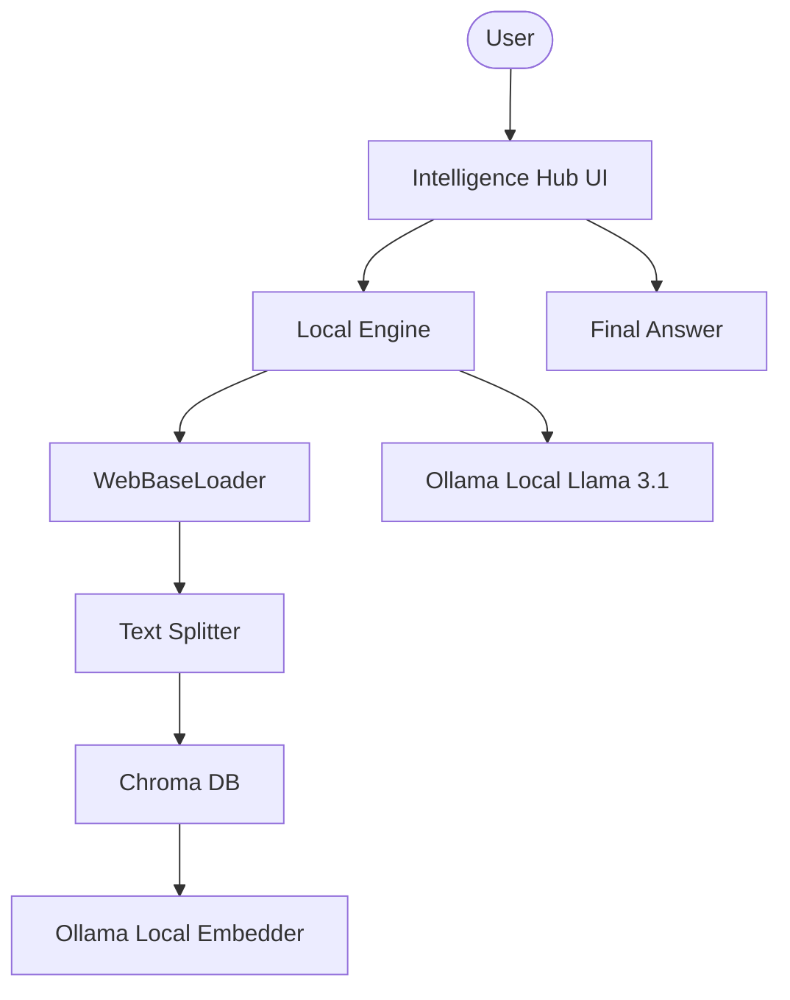

# 🌐 Local Web Intelligence Hub

A privacy-first RAG platform built with Llama 3.1 and Ollama. This platform enables users to "harvest" knowledge from any web page and query it locally without data ever leaving their machine.

## 🌟 Features

- **100% Local Intelligence**: Powered by Ollama for privacy-focused reasoning and embeddings.
- **On-Demand Web Harvesting**: Real-time crawling and indexing of web URLs into a local Chroma vector store.
- **LangChain Integration**: Built with robust modular chains for document loading, splitting, and retrieval.
- **Customizable Core**: Easily switch between different Ollama models (Llama 3.1, Mistral, etc.) via the UI.
- **Focused Research UI**: Clean Streamlit interface optimized for rapid web-source analysis.

## 🏗️ Architecture



## 🛠️ Quick Start

1. **Local LLM**:
   Install [Ollama](https://ollama.com/) and pull Llama 3.1:

   ```bash
   ollama pull llama3.1
   ```

2. **Clone & Install**:

   ```bash
   git clone https://github.com/hamzach9410/LLM-PROJECTS-PACK.git
   cd rag_tutorials/llama3.1_local_rag
   pip install -r requirements.txt
   ```

3. **Run the Hub**:
   ```bash
   streamlit run app.py
   ```

## 📦 Project Structure

- `app.py`: Main interactive research and harvesting dashboard.
- `rag_engine.py`: Core logic for web crawling, vector management, and RAG execution.
- `rag_config.py`: Configuration for local Ollama endpoints and model settings.
- `utils.py`: UI styling and session helper utilities.

## 🚀 Professional Modernization

This project has been transformed from a single-script tutorial into a robust local research tool. It focuses on the convergence of privacy and performance, enabling secure analysis of public web content on private hardware.
