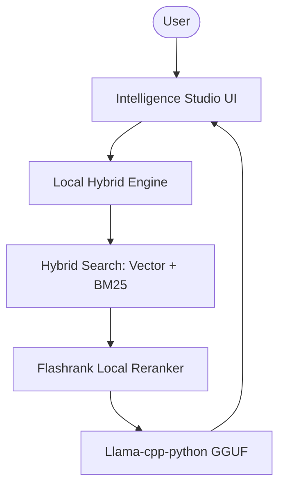

# 🖥️ Local Hybrid Intelligence Studio

A professional-grade local RAG platform that enables **Hybrid (Semantic + Keyword) Search** using GGUF models. Built with `raglite` and `llama-cpp-python`, this platform allows you to run a complete intelligence stack (LLM + Embeddings + Reranker) entirely on your own hardware.

## 🌟 Features

- **100% GGUF Compatibility**: Run high-performance quantized models (Llama 3, Mistral, etc.) directly on CPU or GPU.
- **Local Hybrid Search**: Combines BM25 keyword matching with vector similarity for superior retrieval recall.
- **Micro Reranking**: Uses `flashrank` (ms-marco-MiniLM) for localized, hardware-efficient document prioritization.
- **Private Signal Processing**: Document ingestion and query synthesis occur locally, ensuring total data sovereignty.
- **Professional Core**: Leverages `raglite` for industrial-strength document chunking and local storage management.

## 🏗️ Architecture



## 🛠️ Quick Start

1. **Model Preparation**:
   Download your preferred GGUF models for both an LLM and an Embedder (e.g., from HuggingFace).

2. **Clone & Install**:

   ```bash
   git clone https://github.com/hamzach9410/LLM-PROJECTS-PACK.git
   cd rag_tutorials/local_hybrid_search_rag
   pip install -r requirements.txt
   ```

3. **Configure Paths**:
   Provide the **absolute paths** to your GGUF files in the app sidebar.

4. **Run the Studio**:
   ```bash
   streamlit run app.py
   ```

## 📦 Project Structure

- `app.py`: Main interactive research and orchestration dashboard.
- `rag_config.py`: Configuration for `raglite` using local GGUF model paths.
- `rag_engine.py`: Core logic for local ingestion, hybrid search, and RAG execution.
- `utils.py`: UI styling and session management.

## 🚀 Professional Modernization

This project has been transformed from a single-script tutorial into a robust local intelligence hub. It focuses on the convergence of model quantization and hybrid search to deliver industrial-grade RAG performance on consumer-grade hardware.
