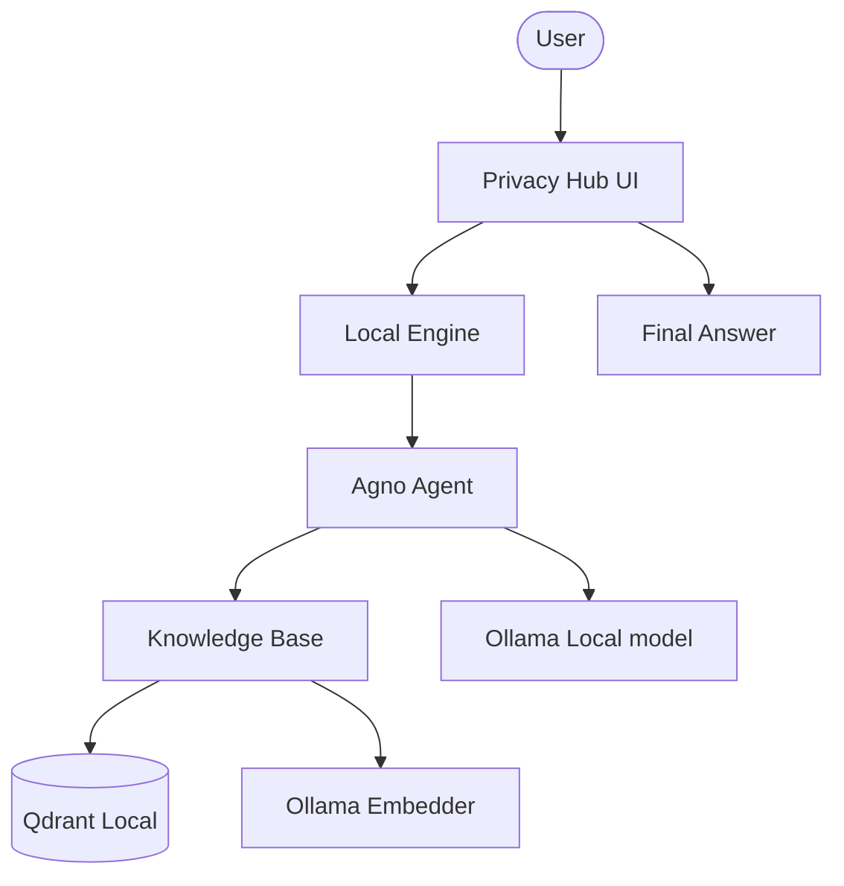

# 🛡️ Local Privacy Intelligence Hub

A professional-grade local RAG platform designed for absolute data sovereignty. Built with Agno, Qdrant, and Ollama, this platform enables users to build personal knowledge bases and query them using agentic AI—entirely offline.

## 🌟 Features

- **Personal Data Sovereignty**: 100% local execution for embeddings, storage, and reasoning.
- **Agentic Knowledge Retrieval**: Uses the Agno framework to intelligently search across indexed documentation.
- **Qdrant Vector Cluster**: Industrial-grade local vector storage for high-speed similarity search.
- **Local Embedding Pipeline**: Utilizes `OllamaEmbedder` for private document vectorization.
- **Dynamic Source Ingestion**: Easily index PDF URLs or local files into your private vault.

## 🏗️ Architecture



## 🛠️ Quick Start

1. **Local Infrastructure**:
   Ensure [Ollama](https://ollama.com/) and [Qdrant](https://qdrant.tech/) (Docker or binary) are running.

   ```bash
   ollama pull llama3.2
   ```

2. **Clone & Install**:

   ```bash
   git clone https://github.com/hamzach9410/LLM-PROJECTS-PACK.git
   cd rag_tutorials/local_rag_agent
   pip install -r requirements.txt
   ```

3. **Run the Hub**:
   ```bash
   streamlit run app.py
   ```

## 📦 Project Structure

- `app.py`: Main interactive research and orchestration dashboard.
- `rag_engine.py`: Core logic for private document ingestion and agentic execution.
- `agents_config.py`: Configuration for the Ollama agent and Qdrant vector storage.
- `utils.py`: UI styling and session management.

## 🚀 Professional Modernization

This project has been transformed from a single-script tutorial into a robust privacy-focused research hub. It focuses on the total isolation of data, providing a high-performance RAG environment without the need for cloud-based providers.
