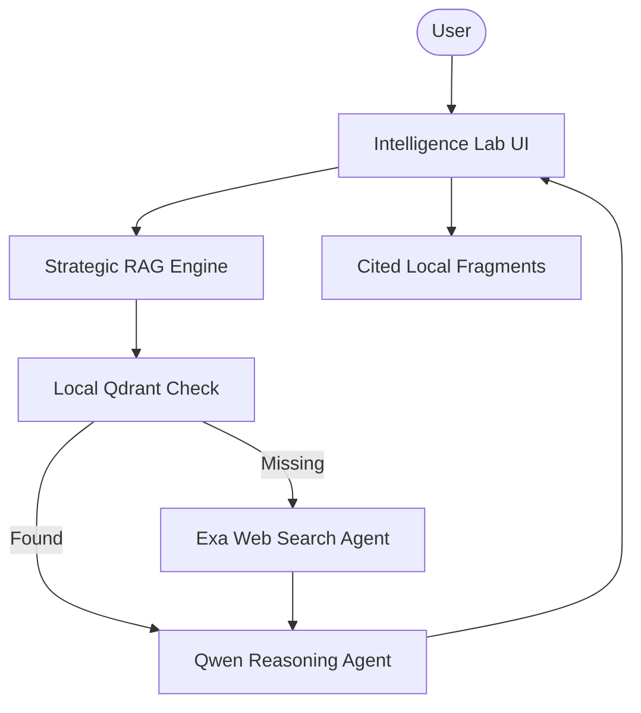

# 🐋 Qwen 2.5 Strategic Intelligence Lab

A high-performance local RAG platform designed for strategic intelligence analysis. Built with Qwen 2.5, Agno, and Qdrant, this platform seamlessly integrates local document research with real-time web search fallback for comprehensive analysis.

## 🌟 Features

- **Multi-Model Local Support**: Choose between Qwen 2.5, Gemma 3, and DeepSeek-R1 for localized reasoning.
- **Hybrid Intelligence Flow**: Prioritizes local vector-stored documents; falls back to Exa Web Search for missing data.
- **Qdrant Vector Cluster**: Industrial-grade local vector storage for high-fidelity document retrieval.
- **Strategic Ingestion**: Real-time crawling of web sources and PDF indexing with metadata tracking.
- **Premium Research UI**: Sophisticated dark-themed Streamlit interface for seamless intelligence orchestration.

## 🏗️ Architecture



## 🛠️ Quick Start

1. **Infrastructure**:
   Ensure [Ollama](https://ollama.com/) and [Qdrant](https://qdrant.tech/) are running locally.

   ```bash
   ollama pull qwen2.5:1.5b
   ```

2. **Clone & Install**:

   ```bash
   git clone https://github.com/hamzach9410/LLM-PROJECTS-PACK.git
   cd rag_tutorials/qwen_local_rag
   pip install -r requirements.txt
   ```

3. **Configure Settings**:
   Provide your Exa API key (optional) in the sidebar for web search capabilities.

4. **Run the Lab**:
   ```bash
   streamlit run app.py
   ```

## 📦 Project Structure

- `app.py`: Main interactive research and orchestration dashboard.
- `rag_engine.py`: Core logic for PDF/Web processing and priority retrieval.
- `agents_config.py`: Configuration for Qwen and Web Search agents.
- `vector_store.py`: Local Qdrant cluster management and custom Ollama embedders.
- `utils.py`: UI research aesthetics and session management.

## 🚀 Professional Modernization

This project has been transformed from a single-script tutorial into a robust strategic intelligence hub. It focuses on the agility of local model execution and the power of hybrid search to deliver accurate analysis in high-stakes environments.
