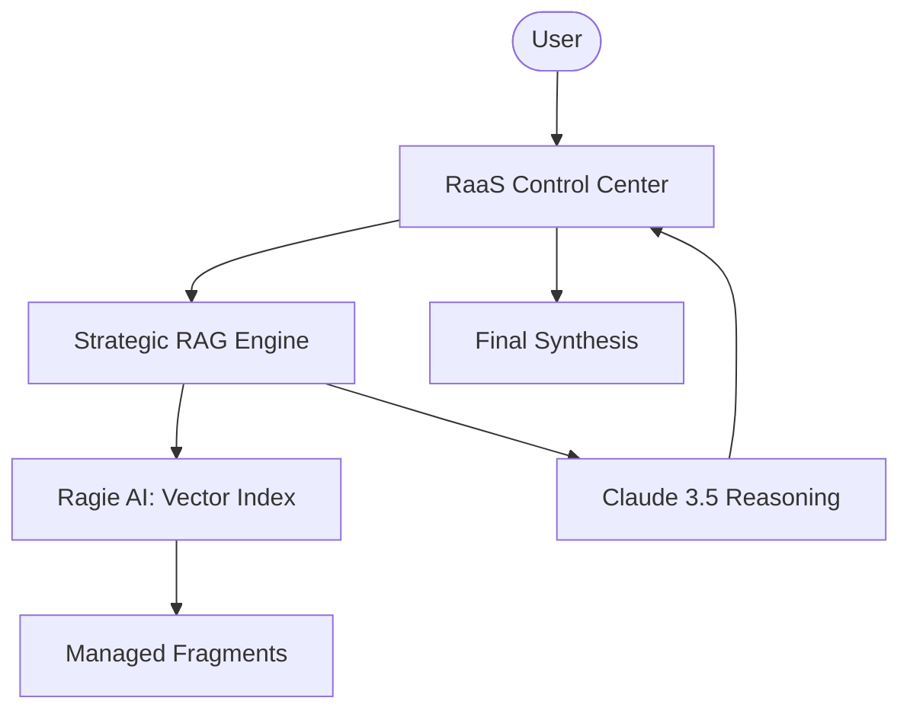

# 🔗 Industrial RAG-as-a-Service (RaaS)

A professional cloud-native RAG platform that provides high-fidelity intelligence as a service. This platform utilizes Ragie.ai for managed document indexing and retrieval, combined with Anthropic's Claude 3.5 Sonnet for superior reasoning and synthesis.

## 🌟 Features

- **Managed Document Indexing**: Leveraging Ragie.ai for high-performance scaleable document storage and retrieval.
- **Enterprise-Grade Reasoning**: Powered by Claude 3.5 Sonnet for accurate, context-aware answers.
- **Strategic API Integration**: Purpose-built clients for seamless interaction with cloud-based AI infrastructure.
- **Dynamic Ingestion**: Programmatic upload and indexing of public web documentation into a unified knowledge vault.
- **Real-time Synthesis**: High-speed retrieval-to-generation pipeline with professional-grade UI monitoring.

## 🏗️ Architecture



## 🛠️ Quick Start

1. **API Setup**:
   Obtain API keys from [Ragie.ai](https://ragie.ai) and [Anthropic](https://anthropic.com).

2. **Clone & Install**:

   ```bash
   git clone https://github.com/hamzach9410/LLM-PROJECTS-PACK.git
   cd rag_tutorials/rag-as-a-service
   pip install -r requirements.txt
   ```

3. **Configure Infrastructure**:
   Provide your API keys in the app sidebar to activate the RAG engine.

4. **Run the Service**:
   ```bash
   streamlit run app.py
   ```

## 📦 Project Structure

- `app.py`: Main interactive RAG control center and orchestration dashboard.
- `rag_engine.py`: Core logic for multi-stage retrieval and synthesis pipelines.
- `ragie_client.py`: High-level client for managing Ragie AI cloud documentation.
- `anthropic_client.py`: Clean wrapper for Claude 3.5 Sonnet intelligence.
- `utils.py`: Industrial UI styling and session management.

## 🚀 Professional Modernization

This project has been transformed from a single-script tutorial into a robust cloud-native RAG service. It focuses on the abstraction of infrastructure, allowing for rapid deployment of high-fidelity AI analysis tools using industrial-ready APIs.
