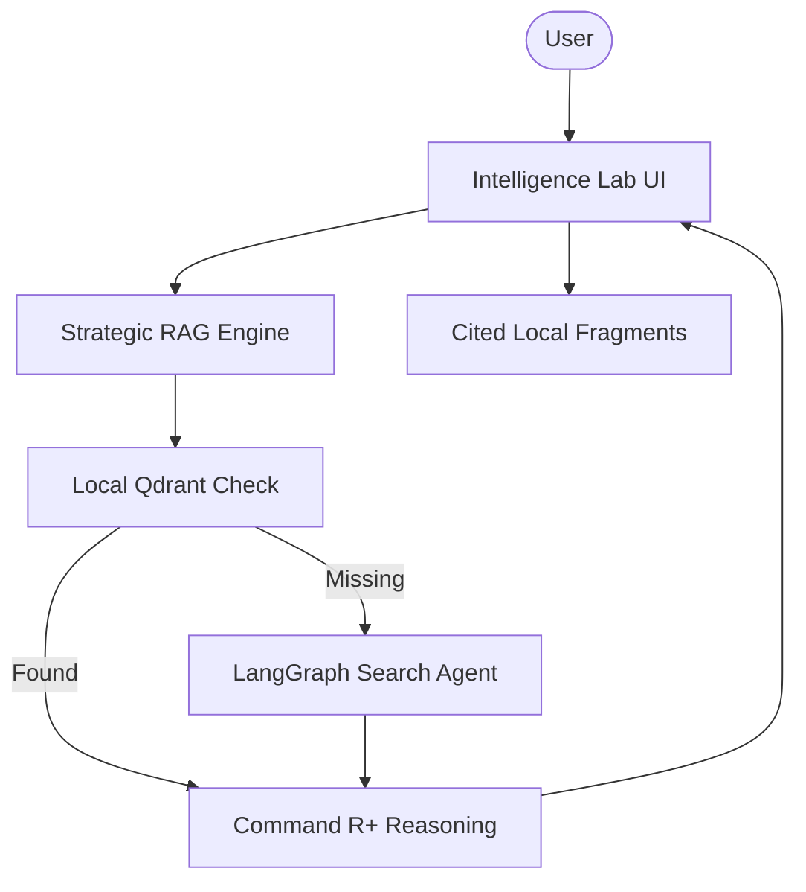

# ⌘ Cohere Strategic Intelligence Lab

A high-performance agentic RAG platform built with Cohere's latest models and Qdrant vector storage. This platform seamlessly integrates local document research with a LangGraph-powered web search fallback, ensuring comprehensive analysis across private and public data.

## 🌟 Features

- **Command ⌘R+ Integration**: Powered by Cohere's Command R+ for state-of-the-art agentic reasoning and synthesis.
- **Hybrid Knowledge Flow**: Prioritizes local vector-stored documents; falls back to an autonomous web research agent if needed.
- **Qdrant Vector Cluster**: Industrial-grade vector storage for high-fidelity, scaleable document retrieval.
- **Agentic Fallback**: Uses LangGraph to orchestrate a web research agent when internal documentation is insufficient.
- **Premium Intelligence UI**: Clean, professional Streamlit interface for seamless document analysis and research.

## 🏗️ Architecture



## 🛠️ Quick Start

1. **API Infrastructure**:
   Obtain API keys from [Cohere](https://cohere.com/) and [Qdrant Cloud](https://cloud.qdrant.io/).

2. **Clone & Install**:

   ```bash
   git clone https://github.com/hamzach9410/LLM-PROJECTS-PACK.git
   cd rag_tutorials/rag_agent_cohere
   pip install -r requirements.txt
   ```

3. **Configure Settings**:
   Provide your Cohere and Qdrant credentials in the app sidebar.

4. **Run the Lab**:
   ```bash
   streamlit run app.py
   ```

## 📦 Project Structure

- `app.py`: Main interactive research and orchestration dashboard.
- `rag_engine.py`: Core logic for prioritized retrieval and agentic fallback execution.
- `agents_config.py`: Configuration for Cohere models and LangGraph research agents.
- `vector_store.py`: Qdrant cluster management and vector store initialization.
- `utils.py`: UI research aesthetics and session management.

## 🚀 Professional Modernization

This project has been transformed from a single-script tutorial into a robust strategic research hub. It focuses on the power of agentic RAG to navigate complex documentation and public web data, providing a high-fidelity intelligence platform for industrial-grade research.
