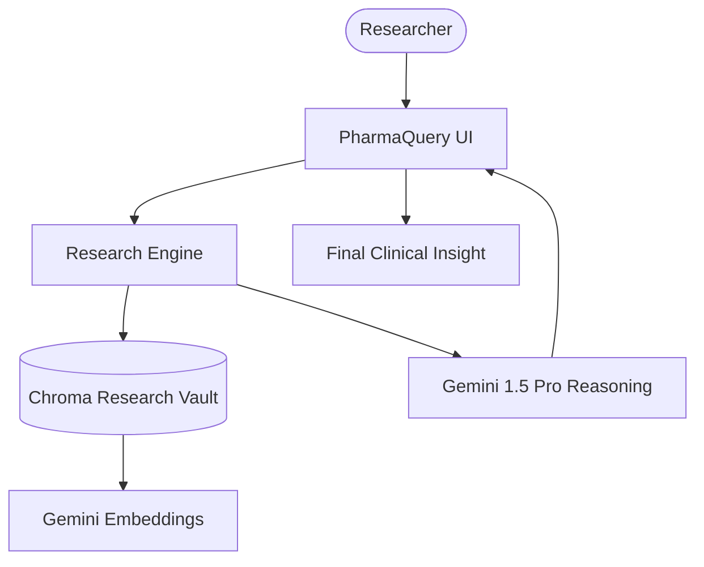

# 🧬 PharmaQuery: Strategic Research Hub

A professional-grade RAG platform dedicated to pharmaceutical research and drug discovery insights. Built with Google Gemini, LangChain, and ChromaDB, this system provides specialized retrieval and synthesis of clinical documentation.

## 🌟 Features

- **Clinical Document Ingestion**: Optimized PDF processing with `SentenceTransformers` for high-fidelity technical fragmenting.
- **Strategic Research Synthesis**: Powered by Gemini 1.5 Pro for precise, context-aware analysis of pharmaceutical data.
- **Localized Vector Vault**: Persistent ChromaDB storage for specialized research collections.
- **Enterprise Reasoning**: Specialized prompt engineering for scientific accuracy and technical clarity.
- **Clinical UI Interface**: Clean, medical-grade Streamlit interface designed for research workflows.

## 🏗️ Architecture



## 🛠️ Quick Start

1. **API Setup**:
   Obtain a [Google AI API Key](https://aistudio.google.com/).

2. **Clone & Install**:

   ```bash
   git clone https://github.com/hamzach9410/LLM-PROJECTS-PACK.git
   cd rag_tutorials/rag_chain
   pip install -r requirements.txt
   ```

3. **Activate Lab**:
   Provide your API key in the sidebar to initialize the research infrastructure.

4. **Run the Lab**:
   ```bash
   streamlit run app.py
   ```

## 📦 Project Structure

- `app.py`: Main interactive research orchestration dashboard.
- `rag_engine.py`: Core logic for technical document ingestion and RAG execution.
- `rag_config.py`: Configuration for Gemini models and vector storage settings.
- `utils.py`: Clinical UI aesthetics and session management.

## 🚀 Professional Modernization

This project has been transformed from a foundational RAG tutorial into a specialized research hub. It focuses on the precision required for pharmaceutical data, providing a robust platform for clinical document analysis and insight discovery.
