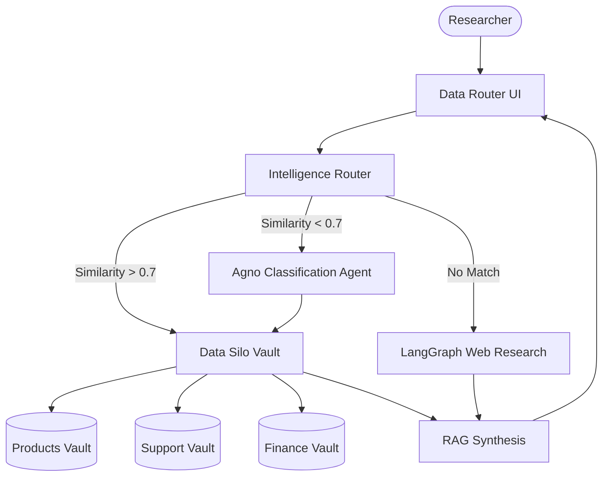

# 📠 Multi-Source Intelligence Router

A specialized RAG orchestration platform designed to operate across heterogeneous data silos. This system implements a hybrid routing architecture that synchronizes internal knowledge bases—Products, Support, and Finance—with an agentic fallback mechanism for comprehensive query resolution.

## 🌟 Features

- **Hybrid Query Routing**: Combines high-confidence semantic similarity with Agno-powered agentic classification to direct queries to the optimal data silo.
- **Heterogeneous Silo Management**: Specialized ingestion pathways for Product Specifications, Customer Support FAQs, and Financial Documentation.
- **LangGraph Web Fallback**: Integrated DuckDuckGo research agent that takes over when internal knowledge silos lack pertinent information.
- **Multi-Tab Orchestration**: Clean, industrial Streamlit interface for managing concurrent data streams and research cycles.
- **Industrial Infrastructure**: Powered by OpenAI GPT-4o and Qdrant for enterprise-grade retrieval and reasoning.

## 🏗️ Architecture



## 🛠️ Quick Start

1. **API Infrastructure**:
   Obtain API keys from [OpenAI](https://platform.openai.com/) and [Qdrant Cloud](https://cloud.qdrant.io/).

2. **Clone & Install**:

   ```bash
   git clone https://github.com/hamzach9410/LLM-PROJECTS-PACK.git
   cd rag_tutorials/rag_database_routing
   pip install -r requirements.txt
   ```

3. **Synchronize Cluster**:
   Configure your research cluster credentials in the laboratory sidebar.

4. **Run the Router**:
   ```bash
   streamlit run app.py
   ```

## 📦 Project Structure

- `app.py`: Main interactive routing and data orchestration dashboard.
- `router_engine.py`: Core logic for hybrid routing, silo RAG execution, and web fallback.
- `rag_config.py`: Configuration for OpenAI, Qdrant, and Agno service clients.
- `utils.py`: Industrial UI aesthetics and PDF fragmenting logic.

## 🚀 Professional Modernization

This project has been transformed from a basic database router into a robust intelligence orchestration hub. It focuses on the precision of data locality and the agility of agentic fallbacks to deliver a high-performance RAG platform for complex enterprise ecosystems.
