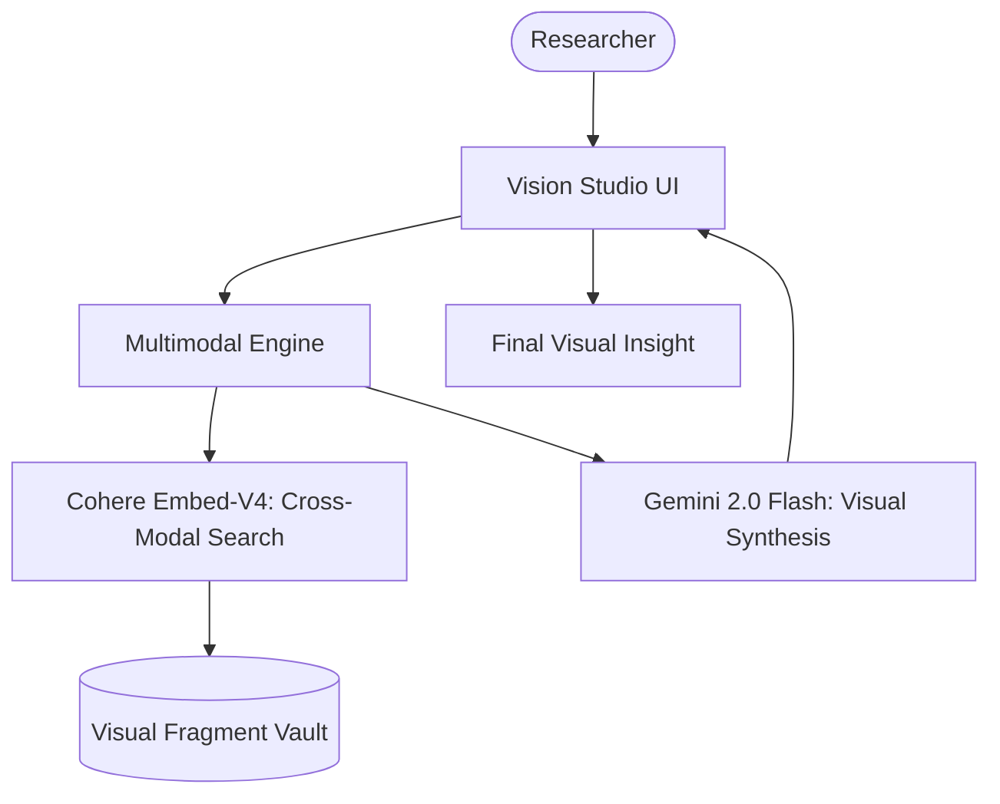

# 🎨 Vision Multimodal Research Studio

A high-fidelity multimodal RAG platform engineered for visual intelligence. This platform utilizes Cohere's state-of-the-art multimodal Embed-V4 models to search across images and PDF pages, paired with Gemini 2.0 Flash for comprehensive visual synthesis.

## 🌟 Features

- **Cross-Modal Search**: Directly query visual documentation (charts, infographics, diagrams) using natural language.
- **Cohere Embed-V4 Intelligence**: Advanced multimodal embeddings that synchronize text and image representations in a unified vector space.
- **Multimodal PDF Ingestion**: Automatic extraction and embedding of high-resolution PDF pages for visual analysis.
- **Gemini 2.0 Flash Synthesis**: High-speed, accurate reasoning over retrieved visual fragments.
- **Creative Studio UI**: Sophisticated Streamlit interface designed for professional multimodal research workflows.

## 🏗️ Architecture



## 🛠️ Quick Start

1. **API Setup**:
   Obtain API keys from [Cohere](https://cohere.com/) and [Google AI Studio](https://aistudio.google.com/).

2. **Clone & Install**:

   ```bash
   git clone https://github.com/hamzach9410/LLM-PROJECTS-PACK.git
   cd rag_tutorials/vision_rag
   pip install -r requirements.txt
   ```

3. **Initialize Core**:
   Provide your API keys in the laboratory sidebar to activate the vision infrastructure.

4. **Run the Studio**:
   ```bash
   streamlit run app.py
   ```

## 📦 Project Structure

- `app.py`: Main interactive multimodal orchestration dashboard.
- `rag_engine.py`: Core logic for cross-modal search, PDF extraction, and visual synthesis.
- `agents_config.py`: Configuration for Cohere and Google Generative AI clients.
- `utils.py`: High-fidelity UI aesthetics and multimodal image processing.

## 🚀 Professional Modernization

This project has been transformed from a foundation tutorial into a robust multimodal research platform. It focuses on the convergence of visual representation and language reasoning to deliver a high-performance intelligence studio for complex diagrammatic and document-based analysis.
