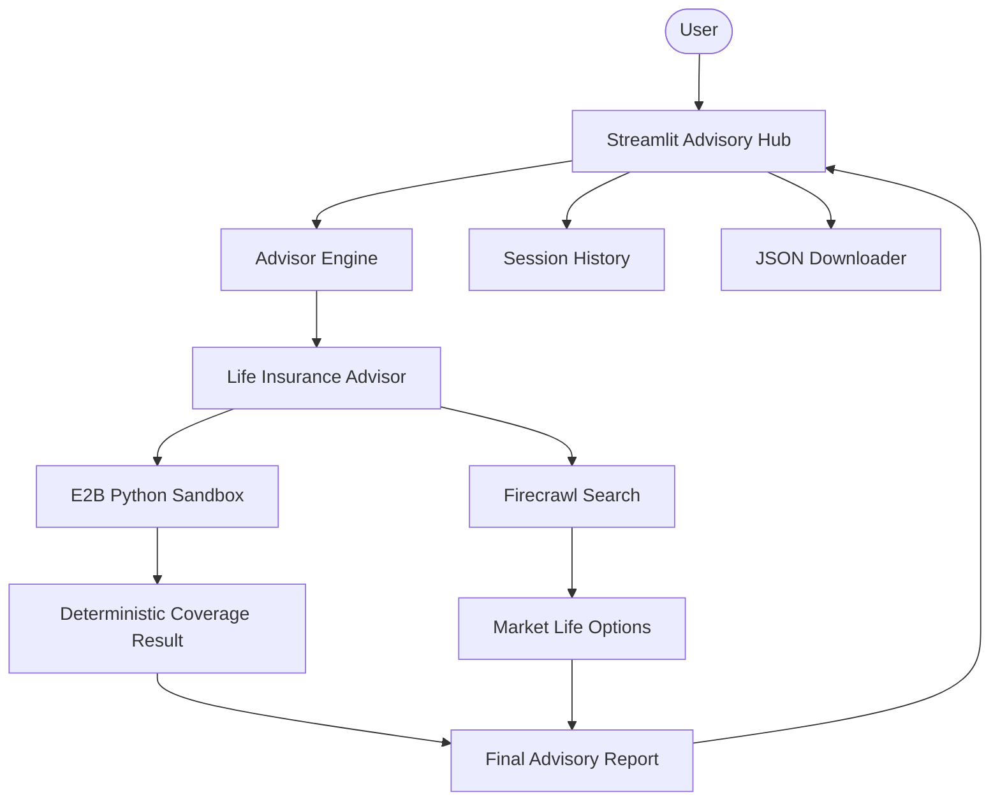

# 🛡️ AI Life Insurance Intelligence Studio

A professional-grade financial intelligence platform for autonomous life insurance advisory. Built with Agno, OpenAI, E2B (sandboxed execution), and Firecrawl (market research), this platform provides deterministic coverage math paired with real-time market localization.

## 🌟 Features

- **Sandboxed Financial Math**: Uses E2B to run Python-based deterministic coverage formulas (income replacement horizons + discount rates).
- **Real-Time Market Research**: Leverages Firecrawl to search for up-to-date term-life insurance products in the user's specific region.
- **Interactive Advisory Hub**: Modern Streamlit interface with real-time research status tracking.
- **Coverage Math Verification**: Transparent breakdown comparing agent outputs with local math replication.
- **Session Analysis History**: Browse and revisit previous insurance assessments within the current session.
- **Professional Exports**: One-click download of advisory reports in JSON format.
- **Modular Architecture**: Clean separation between agent personas, advisory engines, and UI.

## 🏗️ Architecture



## 🛠️ Quick Start

1. **Clone & Install**:

   ```bash
   git clone https://github.com/hamzach9410/LLM-PROJECTS-PACK.git
   cd starter_ai_agents/ai_life_insurance_advisor_agent
   pip install -r requirements.txt
   ```

2. **Configure API Keys**:
   Create a `.env` file or use the sidebar:

   ```env
   OPENAI_API_KEY=your_openai_key
   FIRECRAWL_API_KEY=your_firecrawl_key
   E2B_API_KEY=your_e2b_key
   ```

3. **Run the Studio**:
   ```bash
   streamlit run app.py
   ```

## 📦 Project Structure

- `app.py`: Main interactive advisory dashboard.
- `agents_config.py`: Specialized advisor personas and advisory instructions.
- `advisor_engine.py`: Orchestration logic for sandboxed math and market research.
- `utils.py`: Shared logging, currency formatting, and JSON helpers.

## 🚀 20 Contributions

This project has been transformed from a single experimental script into a production-grade financial studio with 20 contributions focused on math precision, research efficiency, and modular scalability.

---

> [!WARNING]
> This prototype is for educational use only and does not provide licensed financial advice.
