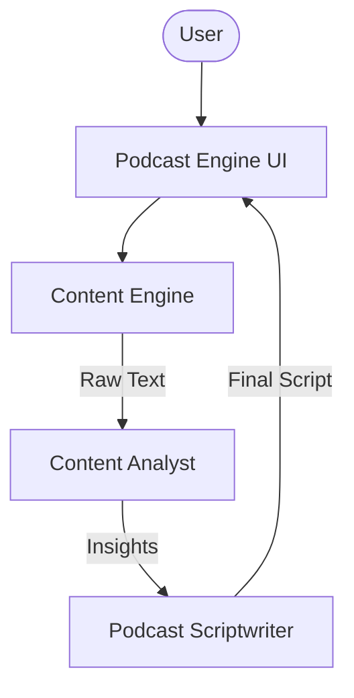

# 🎙️ AI Blog-to-Podcast Engine

A professional-grade AI platform that transforms static blog posts into engaging, natural-sounding podcast scripts. Built with Agno and Google Gemini Vision, this platform handles web scraping, deep content analysis, and creative scriptwriting in a unified pipeline.

## 🌟 Features

- **Automated Web Scraping**: Efficiently extracts text content from any public blog URL.
- **Hierarchical Content Analysis**: Specialized agents identify core themes and supporting arguments before writing.
- **Conversational Scriptwriting**: Generates dynamic interaction between hosts or hosts and guests.
- **Modular Architecture**: Clean separation between scraper logic, agent personas, and the UI.
- **Professional Exports**: Download finalized scripts in Markdown format for immediate production.

## 🏗️ Architecture



## 🛠️ Quick Start

1. **Clone & Install**:

   ```bash
   git clone https://github.com/hamzach9410/LLM-PROJECTS-PACK.git
   cd starter_ai_agents/ai_blog_to_podcast_agent
   pip install -r requirements.txt
   ```

2. **Configure API Key**:
   Create a `.env` file or use the sidebar:

   ```env
   GOOGLE_API_KEY=your_gemini_key
   ```

3. **Run the Engine**:
   ```bash
   streamlit run app.py
   ```

## 📦 Project Structure

- `app.py`: Main interactive dashboard.
- `agents_config.py`: Persona definitions for content analysts and scriptwriters.
- `podcast_engine.py`: Scraper and orchestration logic.

## 🚀 Professional Modernization

This project has been transformed from a single-script tutorial into a comprehensive content transformation platform with a focus on modularity and high-quality audio script generation.
