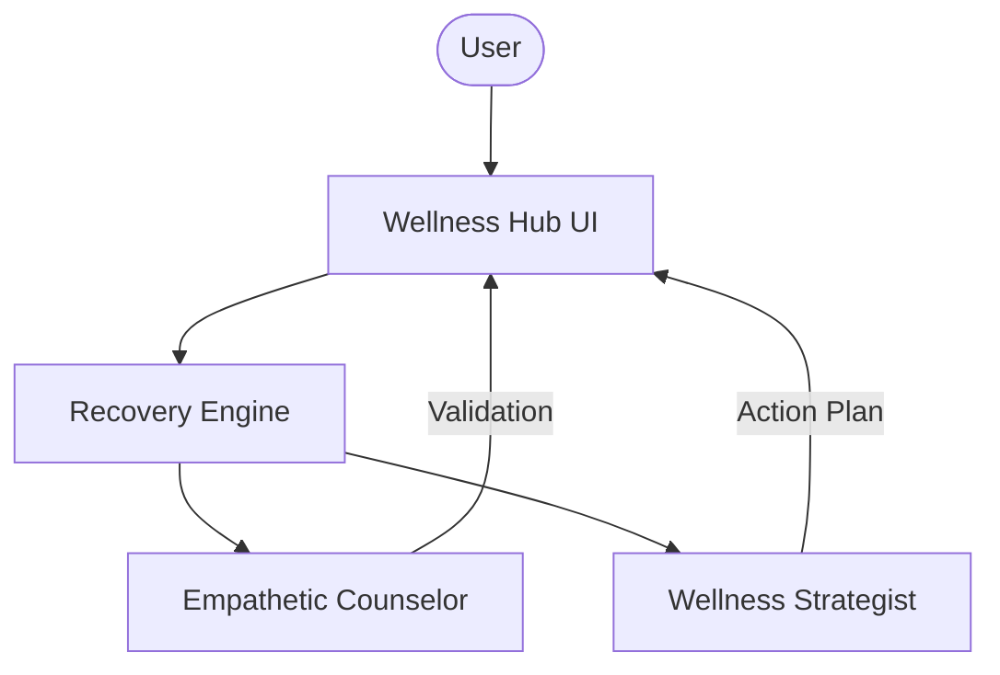

# ❤️ AI Relationship Wellness Platform

A professional-grade AI support platform designed for emotional recovery and personal growth after a breakup. Built with Agno and Google Gemini Vision, this platform provides a dual-agent approach combining deep empathy with practical wellness strategies.

## 🌟 Features

- **Dual-Agent Architecture**:
  - **Empathetic Counselor**: Provides validating, non-judgmental support and emotional perspective.
  - **Wellness Strategist**: Offers actionable self-care routines and personal growth goals.
- **Private & Safe Space**: Interactive interface designed for individual reflection and support.
- **Actionable Wellness Plans**: Transforms emotional insights into concrete steps for moving forward.
- **Session Summaries**: One-click download of your counseling insights and action plans in Markdown.
- **Modern Modular Design**: Clean separation between agent personas, processing engines, and the UI.

## 🏗️ Architecture



## 🛠️ Quick Start

1. **Clone & Install**:

   ```bash
   git clone https://github.com/hamzach9410/LLM-PROJECTS-PACK.git
   cd starter_ai_agents/ai_breakup_recovery_agent
   pip install -r requirements.txt
   ```

2. **Configure API Key**:
   Create a `.env` file or use the sidebar:

   ```env
   GOOGLE_API_KEY=your_gemini_key
   ```

3. **Run the Platform**:
   ```bash
   streamlit run app.py
   ```

## 📦 Project Structure

- `app.py`: Main interactive support dashboard.
- `agents_config.py`: Persona definitions for the Counselor and Strategist.
- `recovery_engine.py`: Orchestration logic for the dual-agent support pipeline.

## 🚀 Professional Modernization

This project has been transformed from a single-script tutorial into a comprehensive emotional support platform with a focus on modularity, security, and high-fidelity wellness guidance.

---

> [!CAUTION]
> This tool is for informational and educational purposes only. It is NOT a substitute for professional mental health services. If you are in crisis, please contact professional emergency services immediately.
