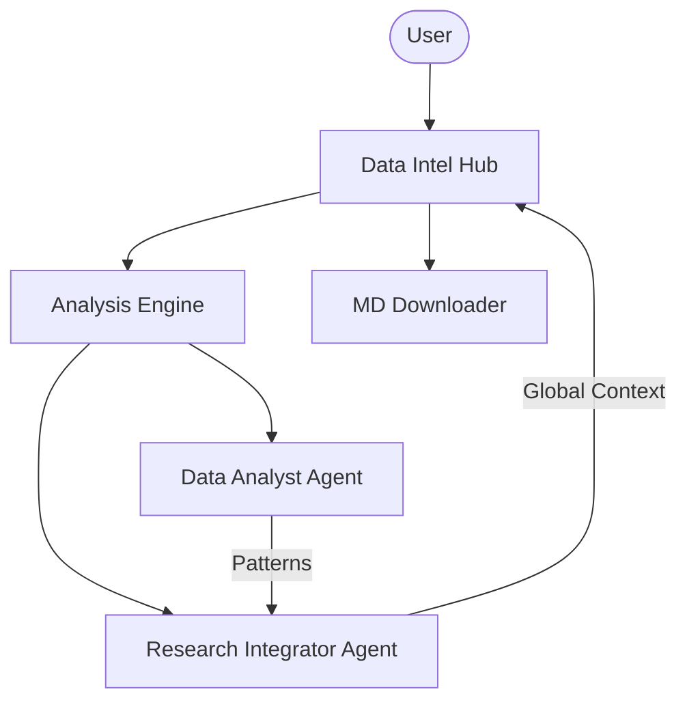

# 🔬 Autonomous Data Intelligence Lab

A professional-grade AI platform for deep data analysis and contextual research. Built with Agno and Google Gemini Vision, this platform autonomously extracts patterns from datasets and enriches them with real-time global context using specialized research agents.

## 🌟 Features

- **Autonomous Data Extraction**: Specialized analyst agent identifies trends, anomalies, and statistical correlations.
- **Real-Time Research Integration**: Integrates DuckDuckGo to provide external context and literature support for findings.
- **Multi-Modal Data Ingestion**: Supports CSV file uploading and raw text context analysis.
- **Structured Reporting**: Generates bifurcated reports covering Internal Analysis and Global Research Context.
- **Professional Exports**: One-click download of comprehensive intelligence reports in Markdown format.

## 🏗️ Architecture



## 🛠️ Quick Start

1. **Clone & Install**:

   ```bash
   git clone https://github.com/hamzach9410/LLM-PROJECTS-PACK.git
   cd starter_ai_agents/ai_data_analysis_agent
   pip install -r requirements.txt
   ```

2. **Configure API Key**:
   Create a `.env` file or use the sidebar:

   ```env
   GOOGLE_API_KEY=your_gemini_key
   ```

3. **Run the Lab**:
   ```bash
   streamlit run app.py
   ```

## 📦 Project Structure

- `app.py`: Main interactive diagnostic dashboard.
- `agents_config.py`: Persona definitions for the Data Analyst and Research Integrator.
- `analysis_engine.py`: Orchestration logic for data processing and research enrichment.

## 🚀 Professional Modernization

This project has been transformed from a single-script tutorial into a comprehensive data intelligence platform with a focus on modularity, scalability, and high-fidelity research integration.
