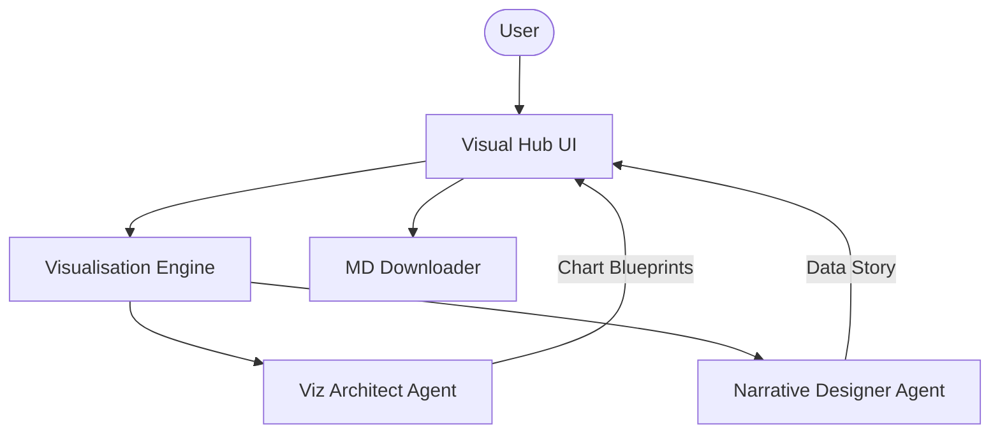

# 🎨 Visual Data Intelligence Hub

A professional-grade AI platform for architectural data visualization and storytelling. Built with Agno and Google Gemini Vision, this platform transforms raw datasets into optimized visualization blueprints and compelling data narratives using specialized design agents.

## 🌟 Features

- **Architectural Chart Blueprinting**: Specialized agent identifies the most effective visualization types for any given data structure.
- **Narrative Storyboarding**: A dedicated design agent crafts engaging captions, titles, and summaries to create a cohesive data story.
- **Multi-Modal Ingestion**: Supports CSV file uploading and trend descriptions for visual planning.
- **Expert Design Snippets**: Provides structured recommendations and Python-ready visualization concepts.
- **Professional Exports**: One-click download of visualization blueprints and narratives in Markdown format.

## 🏗️ Architecture



## 🛠️ Quick Start

1. **Clone & Install**:

   ```bash
   git clone https://github.com/hamzach9410/LLM-PROJECTS-PACK.git
   cd starter_ai_agents/ai_data_visualisation_agent
   pip install -r requirements.txt
   ```

2. **Configure API Key**:
   Create a `.env` file or use the sidebar:

   ```env
   GOOGLE_API_KEY=your_gemini_key
   ```

3. **Run the Hub**:
   ```bash
   streamlit run app.py
   ```

## 📦 Project Structure

- `app.py`: Main interactive visualization dashboard.
- `agents_config.py`: Persona definitions for the Viz Architect and Narrative Designer.
- `visualisation_engine.py`: Orchestration logic for data previewing and design planning.

## 🚀 Professional Modernization

This project has been transformed from a single-script tutorial into a comprehensive visual intelligence platform with a focus on modularity, aesthetic impact, and high-fidelity data storytelling.
