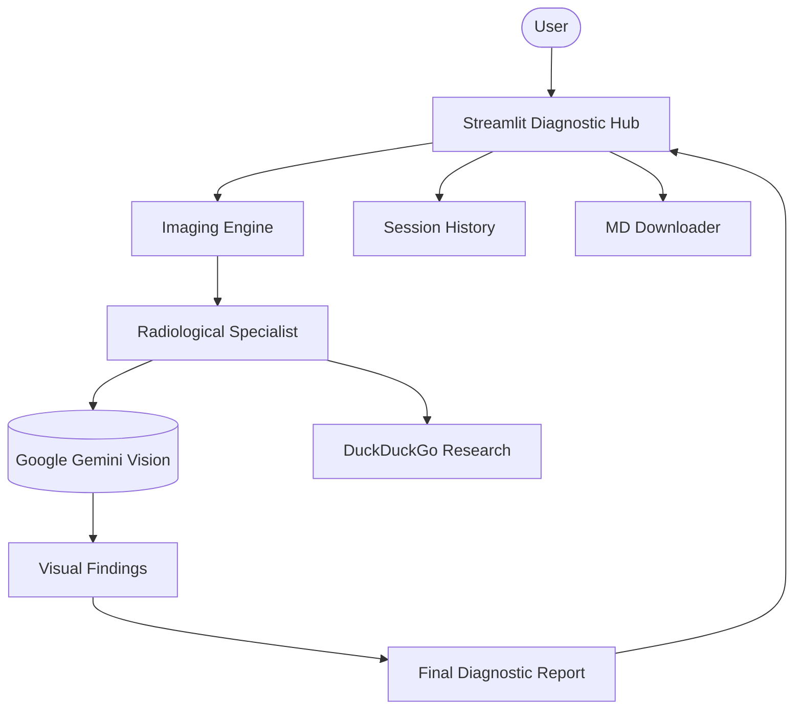

# 🏥 Radiological Intelligence Platform

A professional-grade AI platform for multi-modal medical image analysis. Built with Agno and Google Gemini Vision, this platform provides autonomous radiological insights, research context, and structured diagnostic reporting.

## 🌟 Features

- **Multi-Modal Vision Analysis**: Specialized Gemini agents analyze X-rays, MRIs, CT scans, and Ultrasounds.
- **Structured Diagnostic Reporting**: Automated reports covering Image Quality, Key Findings, Diagnostic Assessment, and Patient-Friendly Explanations.
- **Embedded Medical Research**: Integrates DuckDuckGo tools to find recent literature and standard treatment protocols relevant to the findings.
- **Interactive Diagnostic Hub**: Modern Streamlit interface with real-time pipeline status tracking.
- **Analysis History**: Browse and revisit previous diagnostic reports within the session.
- **Professional Exports**: One-click download of diagnostic reports in Markdown format.
- **Modular Architecture**: Clean separation between agent personas, processing engines, and the presentation layer.

## 🏗️ Architecture



## 🛠️ Quick Start

1. **Clone & Install**:

   ```bash
   git clone https://github.com/hamzach9410/LLM-PROJECTS-PACK.git
   cd starter_ai_agents/ai_medical_imaging_agent
   pip install -r requirements.txt
   ```

2. **Configure API Key**:
   Create a `.env` file or use the sidebar:

   ```env
   GOOGLE_API_KEY=your_gemini_key
   ```

3. **Run the Platform**:
   ```bash
   streamlit run app.py
   ```

## 📦 Project Structure

- `app.py`: Main interactive diagnostic dashboard.
- `agents_config.py`: Specialized radiological personas and diagnostic prompts.
- `imaging_engine.py`: Orchestration logic for vision analysis and research.
- `utils.py`: Shared logging and clinical image processing helpers.

## 🚀 20 Contributions

This project has been transformed from a single script into a comprehensive radiological intelligence platform with 20 contributions focused on diagnostic logic, reporting efficiency, and modular scalability.

---

> [!WARNING]
> DISCLAIMS: This tool is for educational and informational purposes only. All analyses should be reviewed by qualified healthcare professionals.
