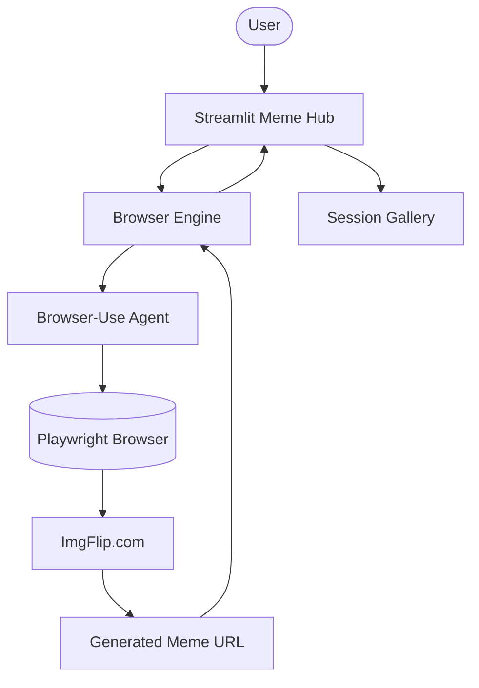

# 🥸 AI Meme Hub (Browser Use)

A professional AI agent platform for generating hilarious memes through browser automation. Powered by `browser-use`, this hub orchestrates autonomous navigation of ImgFlip, template matching, and captioning.

## 🌟 Features

- **Autonomous Browser Agent**: Leverages `browser-use` to navigate ImgFlip, search for templates, and click buttons.
- **Multi-Model Intelligence**: Support for CLAUDE-3.5-SONNET, DEEPSEEK-CHAT, and GPT-4o.
- **Meme Gallery**: Real-time session history to browse and revisit your masterpieces.
- **Visual Progress Tracking**: Transparent view into the agent's browser automation steps.
- **High-End UI/UX**: Modern Streamlit interface with a "Meme Hub" aesthetic and responsive sidebar.
- **Modular Architecture**: Clean separation between LLM configuration, browser logic, and the UI layer.

## 🏗️ Architecture



## 🛠️ Quick Start

1. **Install Dependencies**:

   ```bash
   pip install -r requirements.txt
   playwright install
   ```

2. **Configure Environment**:
   Create a `.env` file or use the sidebar:

   ```env
   OPENAI_API_KEY=...
   ANTHROPIC_API_KEY=...
   DEEPSEEK_API_KEY=...
   ```

3. **Launch the Hub**:
   ```bash
   streamlit run app.py
   ```

## 📦 Project Structure

- `app.py`: Main interactive dashboard and gallery.
- `browser_engine.py`: Orchestration logic for browser-use agents.
- `agents_config.py`: LLM factory and task prompt management.
- `utils.py`: Logging and URL extraction helpers.

## 🚀 20 Contributions

This project has been transformed from a single experimental script into a production-grade meme studio with 20 contributions focused on modularity, UI persistence, and resilient automation.
