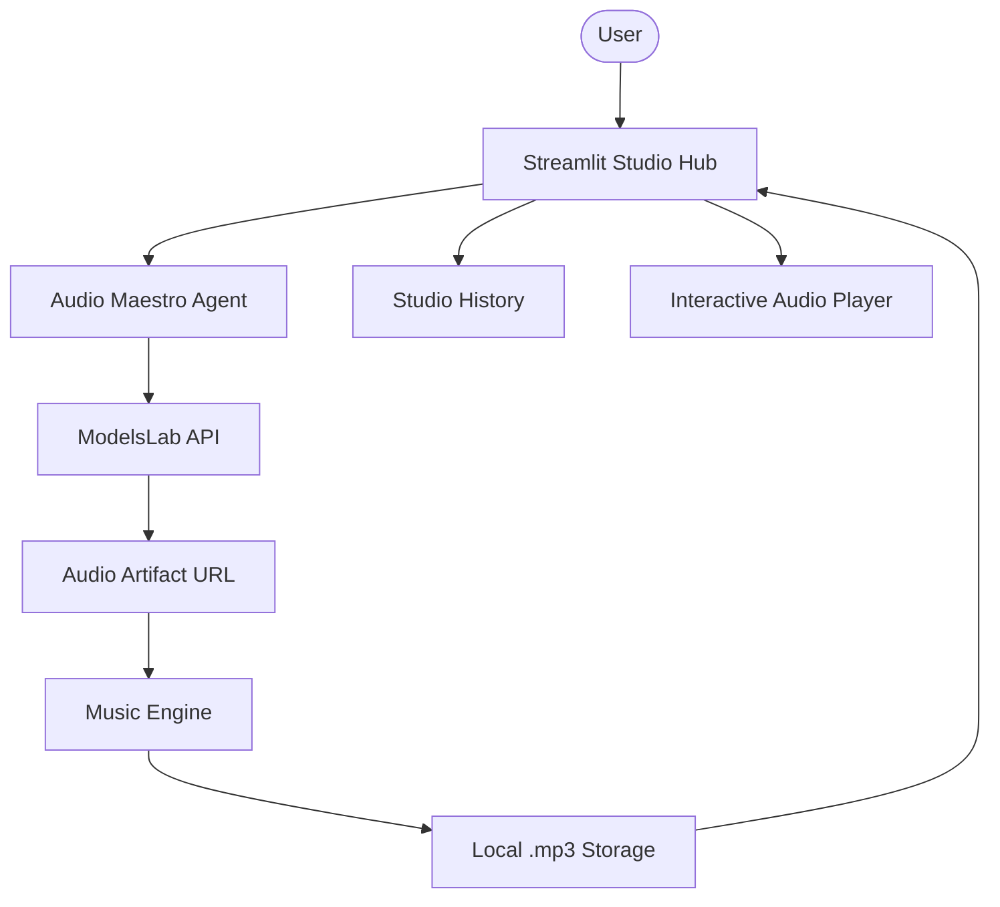

# 🎶 AI Music Composition Studio

A professional AI agent platform for generating high-fidelity instrumental music tracks. Built with Agno, OpenAI, and ModelsLab, this studio transforms text prompts into professional-grade audio compositions with a dedicated session history and persistence layer.

## 🌟 Features

- **Autonomous Composition**: Specialized agent ("Audio Maestro") that strategizes musical elements based on text prompts.
- **High-Fidelity Audio**: Integration with ModelsLab API for professional-grade music generation.
- **Interactive Studio Dashboard**: Modern Streamlit interface with real-time composition status tracking.
- **Studio History persistence**: Browse, play, and download previous compositions within the current session.
- **Local Audio Management**: Automatic downloading and organized storage of generated tracks in a dedicated folder.
- **Professional Exports**: One-click download of master tracks in `.mp3` format.
- **Modular Architecture**: Clean separation between agent definitions, music engine logic, and UI.

## 🏗️ Architecture



## 🛠️ Quick Start

1. **Clone & Install**:

   ```bash
   git clone https://github.com/hamzach9410/LLM-PROJECTS-PACK.git
   cd starter_ai_agents/ai_music_generator_agent
   pip install -r requirements.txt
   ```

2. **Configure API Keys**:
   Create a `.env` file or use the sidebar:

   ```env
   OPENAI_API_KEY=your_openai_key
   MODELSLAB_API_KEY=your_modelslab_key
   ```

3. **Run the Studio**:
   ```bash
   streamlit run app.py
   ```

## 📦 Project Structure

- `app.py`: Main interactive composition dashboard.
- `agents_config.py`: Specialized agent roles and musical composition instructions.
- `music_engine.py`: Resilient audio downloading and local persistence logic.
- `utils.py`: Shared logging and directory management helpers.

## 🚀 20 Contributions

This project has been transformed from a single script into a professional AI Music Studio with 20 contributions focused on composition intelligence, audio management, and modular architecture.
