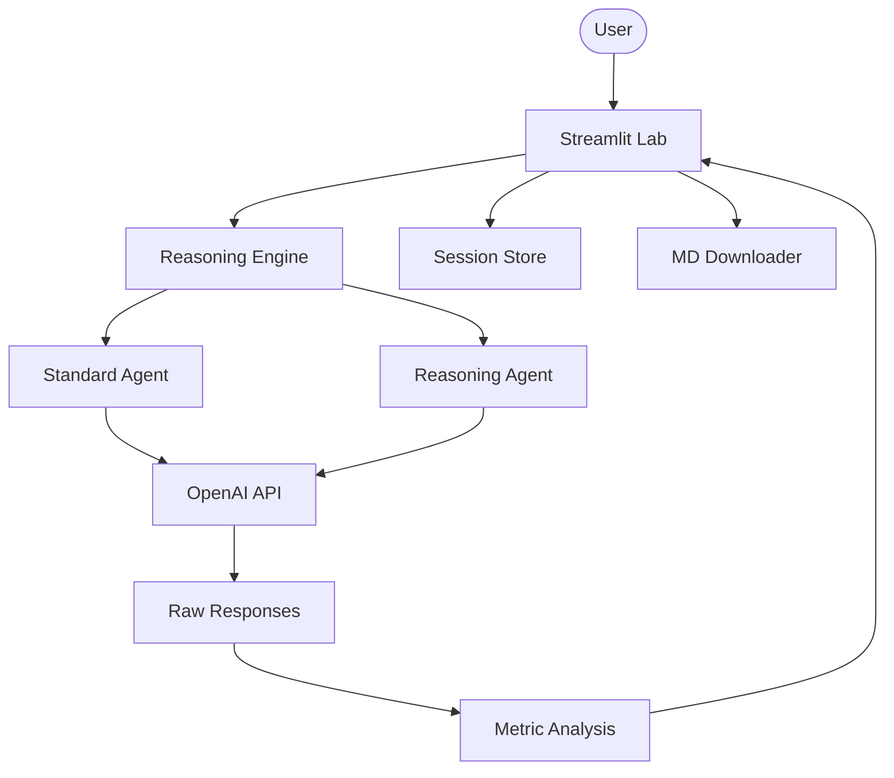

# 🧠 AI Reasoning Intelligence Lab

A professional-grade lab for comparing standard LLM outputs against advanced reasoning models. Designed to visualize the "Thought Process" and quantify the benefits of deep chain-of-thought reasoning.

## 🌟 Features

- **Side-by-Side Comparison**: Evaluate Standard vs Reasoning models (e.g., GPT-4o-mini vs GPT-4o) in real-time.
- **Deep Reasoning Traces**: Full visibility into the logical steps taken by reasoning-enabled agents.
- **Performance Intelligence**: Automatic tracking of latency and token counts for every query.
- **Interactive High-End UI**: Modern Streamlit dashboard with comparative panes and session persistence.
- **Reasoning History**: Revisit previous logical puzzles and their solutions within the session.
- **Professional Exports**: Download comparison reports as Markdown files for further analysis.
- **Modular Architecture**: Clean separation between agent configurations, utilities, and the presentation layer.

## 🏗️ Architecture



## 🛠️ Quick Start

1. **Clone & Install**:

   ```bash
   git clone https://github.com/hamzach9410/LLM-PROJECTS-PACK.git
   cd starter_ai_agents/ai_reasoning_agent
   pip install -r requirements.txt
   ```

2. **Configure API Key**:
   Create a `.env` file or use the sidebar:

   ```env
   OPENAI_API_KEY=your_openai_key
   ```

3. **Run the Lab**:
   ```bash
   streamlit run app.py
   ```

## 📦 Project Structure

- `app.py`: Main interactive laboratory dashboard.
- `agents_config.py`: Specialized definitions for Standard and Reasoning personas.
- `utils.py`: Shared logging, timing, and formatting helpers.

## 🚀 20 Contributions

This project has been transformed from a CLI script into a comprehensive reasoning analysis tool with 20 contributions focused on performance metrics, UI comparison, and modularity.
