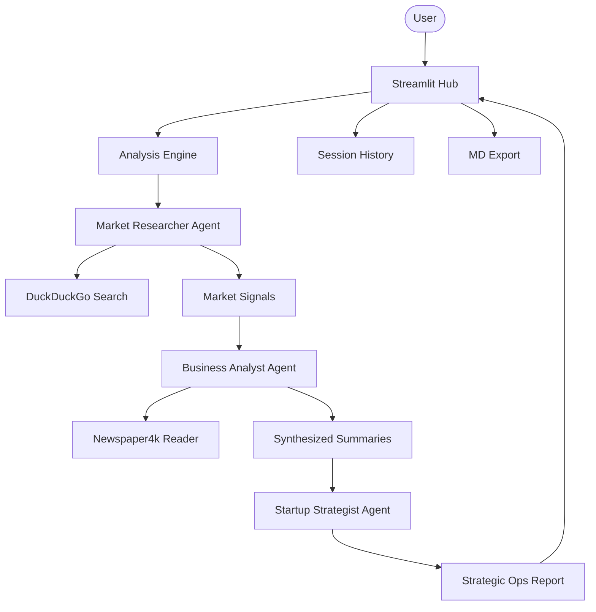

# 📈 Startup Intelligence Hub

A professional multi-agent platform designed to transform raw market signals into strategic startup opportunities. Built with Agno and Google Gemini, this platform automates the research, synthesis, and strategic analysis of emerging technology trends.

## 🌟 Features

- **Multi-Agent Orchestration**: Specialized agents for Market Research, Business Analysis, and Startup Strategy.
- **Deep Market Signal Collection**: Uses DuckDuckGo to gather high-density market news and funding reports.
- **Synthesized Intelligence**: Newspaper4k integration for deep-reading and summarizing industry signals.
- **Strategic Opportunity Mapping**: Generates actionable startup ideas with "Why Now?" insights and SWOT summaries.
- **Interactive High-End Dashboard**: Modern Streamlit interface with real-time research progress tracking.
- **Report Persistence**: Interactive session history and tabbed views for comparing analyses.
- **Professional Exports**: One-click download of strategy reports in Markdown format.

## 🏗️ Architecture



## 🛠️ Quick Start

1. **Clone & Install**:

   ```bash
   git clone https://github.com/hamzach9410/LLM-PROJECTS-PACK.git
   cd starter_ai_agents/ai_startup_trend_analysis_agent
   pip install -r requirements.txt
   ```

2. **Configure API Keys**:
   Create a `.env` file or use the sidebar:

   ```env
   GOOGLE_API_KEY=your_gemini_key
   ```

3. **Run the App**:
   ```bash
   streamlit run app.py
   ```

## 📦 Project Structure

- `app.py`: Main interactive strategic hub.
- `analysis_engine.py`: Multi-stage workflow orchestration.
- `agents_config.py`: Specialized agent roles and business personas.
- `utils.py`: Shared logging and report formatting helpers.

## 🚀 20 Contributions

This project has been transformed from a single script into a professional venture intelligence tool with 20 contributions focused on business specialized agents, UX, and persistence.
