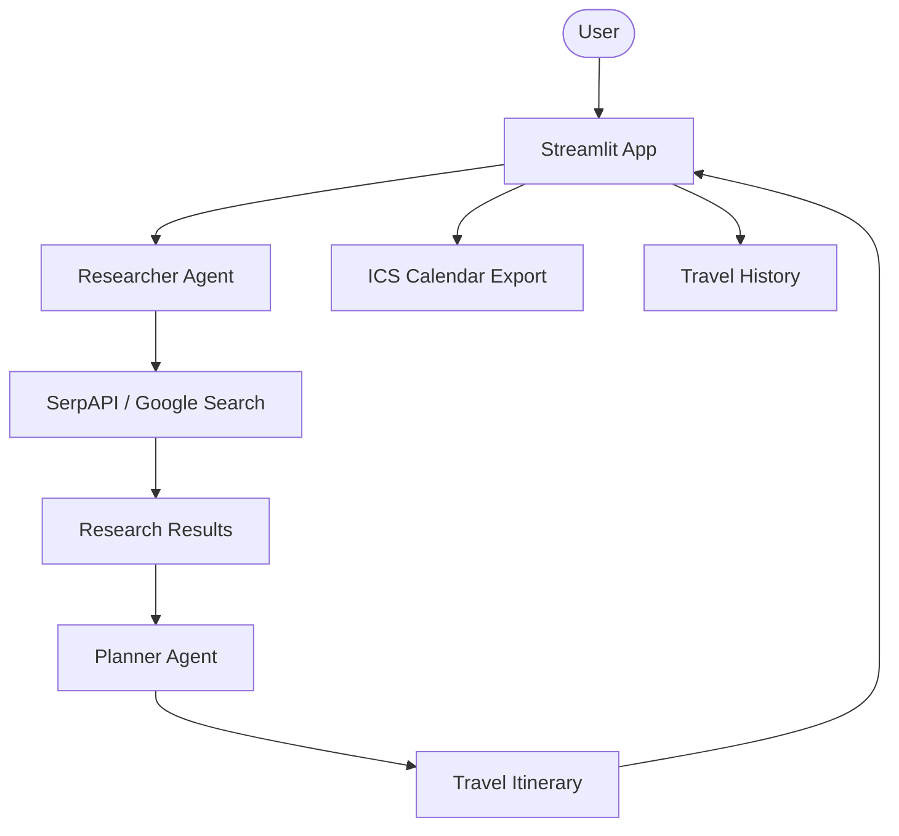

# 🌍 AI Travel Concierge

A professional-grade autonomous travel planning platform built with Agno and OpenAI. It leverages a world-class researcher and a senior planner agent to generate detailed, day-by-day travel itineraries with calendar integration.

## 🌟 Features

- **Autonomous Research**: Researcher agent uses SerpAPI to find the best activities, dining, and accommodations.
- **Expert Planning**: Planner agent synthesizes research into engaging, well-structured itineraries.
- **Calendar Integration**: Export your itinerary directly to your calendar via `.ics` file support.
- **Interactive Dashboard**: Modern Streamlit UI with real-time research status tracking.
- **Trip History**: Keep track of your planned adventures in the current session.
- **Multi-Format Export**: Download reports in Markdown or sync with your calendar.
- **Modular Architecture**: Clean separation of agent definitions, utility logic, and UI.

## 🏗️ Architecture



## 🛠️ Quick Start

1. **Clone & Install**:

   ```bash
   git clone https://github.com/hamzach9410/LLM-PROJECTS-PACK.git
   cd starter_ai_agents/ai_travel_agent
   pip install -r requirements.txt
   ```

2. **Configure API Keys**:
   Create a `.env` file or use the sidebar:

   ```env
   OPENAI_API_KEY=your_openai_key
   SERPAPI_API_KEY=your_serpapi_key
   ```

3. **Run the App**:
   ```bash
   streamlit run app.py
   ```

## 📦 Project Structure

- `app.py`: Main interactive dashboard.
- `agents_config.py`: Definitive agent roles and instructions.
- `utils.py`: Calendar generation and logging helpers.

## 🚀 20 Contributions

This project has been transformed from legacy scripts into a robust travel intelligence platform with 20 professional contributions focused on UX, modularity, and integration features.
