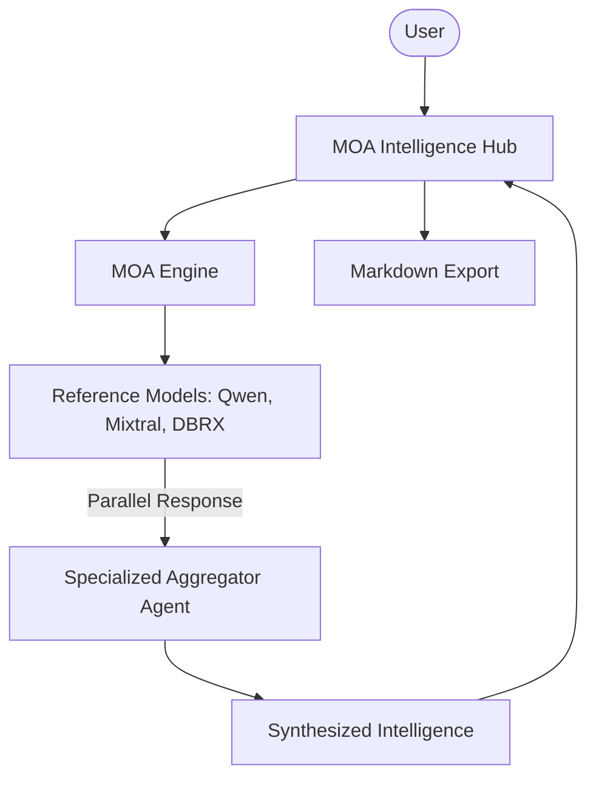

# 🧠 Mixture-of-Agents Intelligence Hub

A professional-grade implementation of the Mixture-of-Agents (MOA) methodology. This platform leverages multiple high-capacity open-source LLMs to generate individual perspectives, which are then synthesized by a specialized aggregator agent into a single, high-fidelity response.

## 🌟 Features

- **Multi-Model Orchestration**: Concurrently queries Qwen, Mixtral, and DBRX models to capture diverse reasoning paths.
- **Intelligent Synthesis**: Uses a dedicated aggregator persona to resolve contradictions and remove biases from candidate responses.
- **Concurrent Processing**: Leveraging `asyncio` for high-performance parallel model invocation.
- **Professional Analytics UI**: A modern Streamlit interface with real-time pipeline status and individual model insights.
- **Report Exporting**: One-click markdown export for the final synthesized intelligence report.

## 🏗️ Architecture



## 🛠️ Quick Start

1. **Clone & Install**:

   ```bash
   git clone https://github.com/hamzach9410/LLM-PROJECTS-PACK.git
   cd starter_ai_agents/mixture_of_agents
   pip install -r requirements.txt
   ```

2. **Configure API Key**:
   Create a `.env` file or use the sidebar:

   ```env
   TOGETHER_API_KEY=your_api_key
   ```

3. **Run the Hub**:
   ```bash
   streamlit run app.py
   ```

## 📦 Project Structure

- `app.py`: Main interactive intelligence dashboard.
- `agents_config.py`: Configuration for reference models and the synthesizer persona.
- `moa_engine.py`: Orchestration logic for parallel LLM calls and aggregation.
- `utils.py`: Shared UI styling and environment validators.

## 🚀 Professional Modernization

This project has been transformed from a basic script into a scalable, production-ready intelligence platform with a focus on modularity, performance, and user experience.
