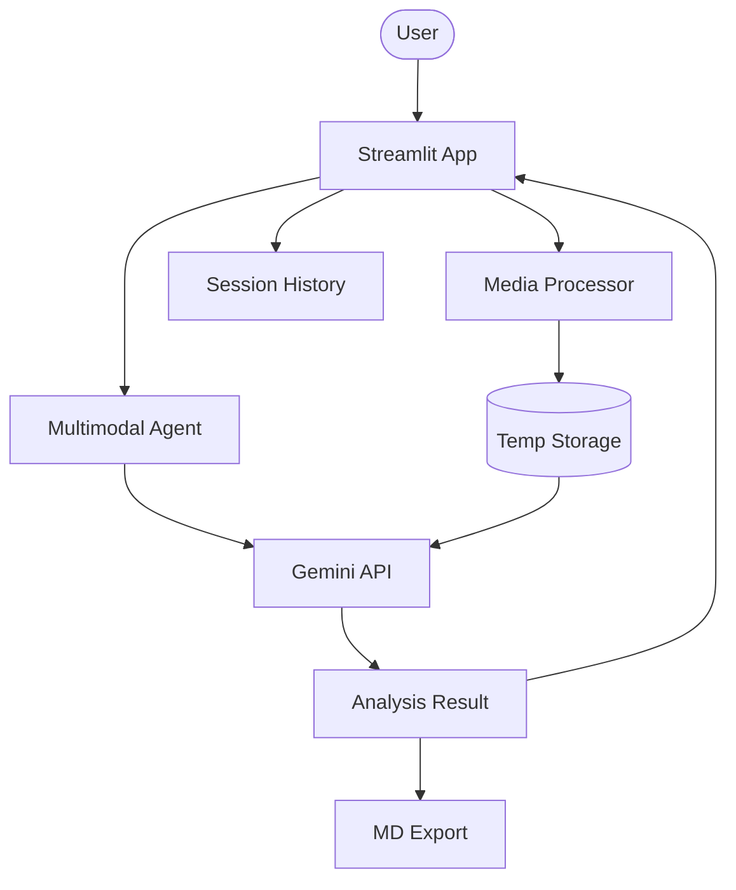

# 🧬 Multimodal Intelligence Dashboard

A professional-grade multimodal analysis platform built with Agno and Google Gemini. Seamlessly analyze Images, Videos, and PDF Documents in a single unified interface with advanced reasoning capabilities.

## 🌟 Features

- **Unified Multi-Modal**: One dashboard for analyzing images, videos, and PDFs simultaneously.
- **Gemini Intelligence**: Powered by Google's latest Gemini 2.0 Flash and 1.5 Pro models.
- **Advanced Reasoning**: Optimized for technical analysis, timestamp summaries, and contextual document parsing.
- **Interactive UI**: Modern Streamlit interface with real-time feedback and processing spinners.
- **Analysis History**: Track and revisit previous session analyses from the sidebar.
- **Professional Exports**: Download analysis results as structured Markdown reports.
- **Modular Backend**: Clean separation of agent configuration, media processing, and dashboard logic.

## 🏗️ Architecture



## 🛠️ Quick Start

1. **Clone & Install**:

   ```bash
   git clone https://github.com/hamzach9410/LLM-PROJECTS-PACK.git
   cd starter_ai_agents/multimodal_ai_agent
   pip install -r requirements.txt
   ```

2. **Configure API Keys**:
   Create a `.env` file or use the sidebar in the app for Gemini:

   ```env
   GEMINI_API_KEY=your_gemini_key_here
   ```

3. **Run the App**:
   ```bash
   streamlit run app.py
   ```

## 📦 Project Structure

- `app.py`: Main dashboard entry point.
- `agents_config.py`: Definitive agent logic and instructions.
- `media_processor.py`: Unified handler for image/video/pdf Agno objects.
- `utils.py`: Shared logging and file cleanup helpers.

## 🚀 20 Contributions

This project has been transformed from fragmented scripts into a cohesive multimodal platform with 20 professional-grade contributions.
