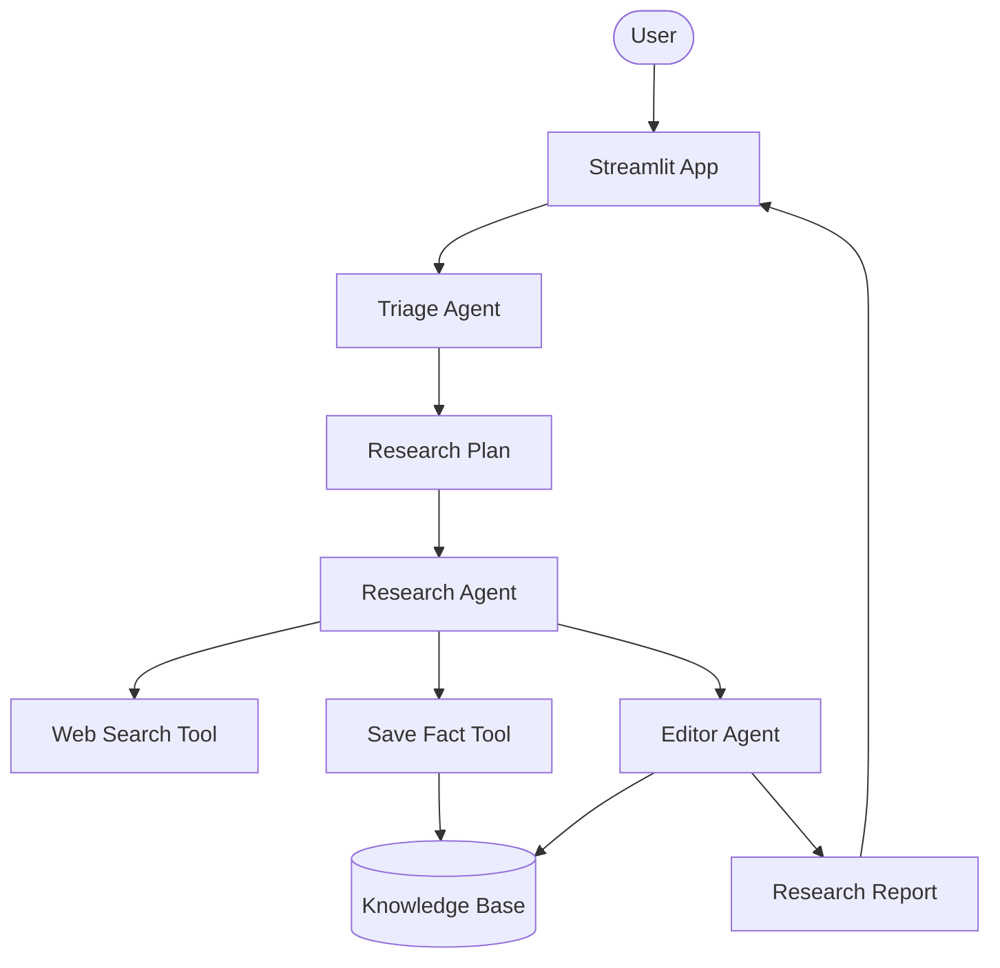

# 📰 OpenAI Research Intelligence Platform

A professional-grade multi-agent research system built with the OpenAI Agents SDK. It coordinates between Triage, Research, and Editor agents to generate comprehensive, structured research reports.

## 🌟 Features

- **Multi-Agent Orchestration**: Powered by OpenAI's Agents SDK for seamless coordination.
- **Structured Planning**: Triage agent creates a detailed research plan before execution.
- **Deep Research**: Research agent explores the web and extracts critical facts with sources.
- **Comprehensive Reporting**: Editor agent synthesizes findings into detailed, 1000+ word reports.
- **Interactive Dashboard**: Modern Streamlit UI with real-time status tracking and session history.
- **Export Ready**: Download generated reports as professional Markdown files.

## 🏗️ Architecture



## 🛠️ Quick Start

1. **Clone & Install**:

   ```bash
   git clone https://github.com/hamzach9410/LLM-PROJECTS-PACK.git
   cd starter_ai_agents/opeani_research_agent
   pip install -r requirements.txt
   ```

2. **Configure API Keys**:
   Create a `.env` file or set the environment variable:

   ```env
   OPENAI_API_KEY=your_openai_key_here
   ```

3. **Run the App**:
   ```bash
   streamlit run app.py
   ```

## 📦 Project Structure

- `app.py`: Main dashboard entry point.
- `agents_config.py`: Definitive agent configuration and instructions.
- `models.py`: Pydantic data models for structured outputs.
- `utils.py`: Shared tools and logging configuration.

## 🚀 20 Contributions

This project has been transformed from a single-file script into a robust research platform with modular code, advanced UI, and enhanced reporting logic.
