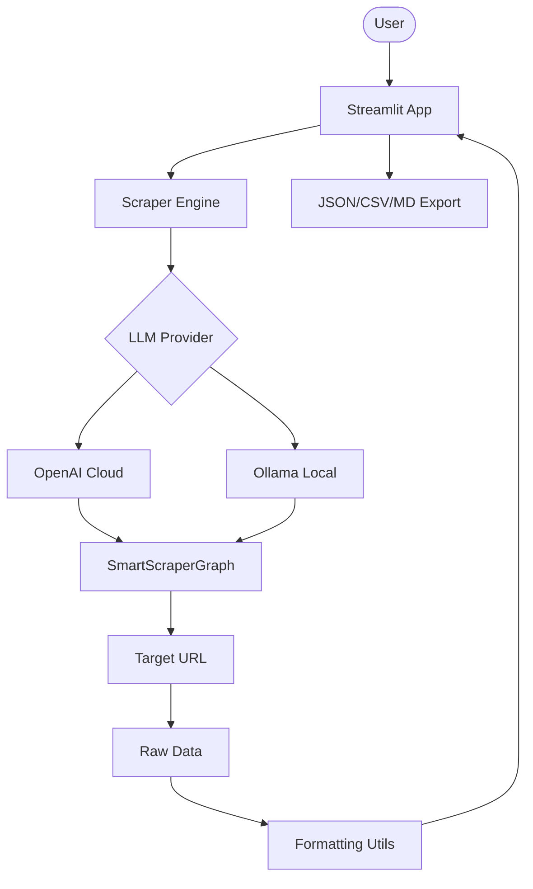

# 🕵️‍♂️ Scraping Intelligence AI Agent

A professional-grade, multi-provider web scraping dashboard built with ScrapeGraphAI. Extract structured data from any website using cloud LLMs (OpenAI) or local models (Ollama).

## 🌟 Features

- **Multi-Provider Support**: Toggle seamlessly between cloud (OpenAI) and local (Ollama) intelligence.
- **Smart Orchestration**: Leverages `SmartScraperGraph` for automated DOM analysis and data extraction.
- **Structured Outputs**: Define exactly what you want to extract using natural language prompts.
- **Interactive UI**: Modern Streamlit interface with real-time extraction metrics and session history.
- **Multi-Format Exports**: One-click download of results as JSON, CSV, or Markdown.
- **Modular Architecture**: Clean separation of configuration, scraping engines, and UI logic.

## 🏗️ Architecture



## 🛠️ Quick Start

1. **Clone & Install**:

   ```bash
   git clone https://github.com/hamzach9410/LLM-PROJECTS-PACK.git
   cd starter_ai_agents/web_scrapping_ai_agent
   pip install -r requirements.txt
   ```

2. **Configure API Keys**:
   Create a `.env` file or use the sidebar in the app for OpenAI:

   ```env
   OPENAI_API_KEY=your_openai_key_here
   ```

3. **Run the App**:
   ```bash
   streamlit run app.py
   ```

## 📦 Project Structure

- `app.py`: Streamlit entry point and UI logic.
- `scraper_engine.py`: Unified engine for handling various LLM graph configurations.
- `config.py`: Global constants and provider settings.
- `utils.py`: Data cleaning and file conversion helpers.

## 🚀 20 Contributions

This project has been transformed from a pair of simple scripts into a comprehensive scraping platform with 20 professional contributions.
