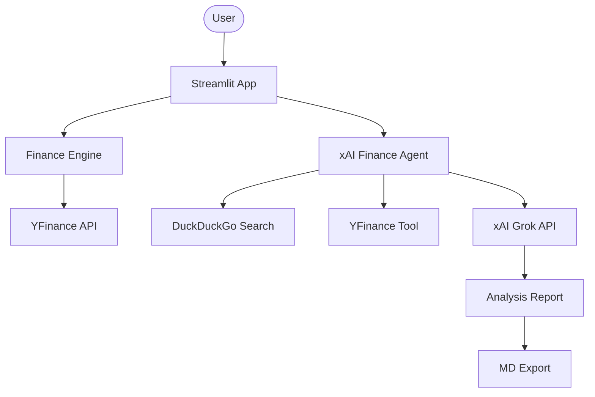

# 💹 xAI Financial Intelligence Dashboard

A professional-grade financial analysis dashboard powered by xAI Grok. It combines real-time stock data, automated technical analysis, and market sentiment tracking into one cohesive interface.

## 🌟 Features

- **Grok Intelligence**: Core analysis powered by xAI's latest models for nuanced financial reasoning.
- **Real-time Metrics**: Live stock prices, market cap, and performance metrics via YFinance.
- **Technical Analysis**: Automated reporting on support/resistance and momentum indicators.
- **Interactive Charts**: Visual price history integration using native Streamlit charts.
- **Watchlist & Portfolio**: Track your favorite tickers across the current session.
- **Professional Exports**: Generate and download detailed markdown reports for any analyzed ticker.
- **Modular Architecture**: Clean separation of data retrieval, agent logic, and UI components.

## 🏗️ Architecture



## 🛠️ Quick Start

1. **Clone & Install**:

   ```bash
   git clone https://github.com/hamzach9410/LLM-PROJECTS-PACK.git
   cd starter_ai_agents/xai_finance_agent
   pip install -r requirements.txt
   ```

2. **Configure API Keys**:
   Create a `.env` file or use the sidebar settings in the app:

   ```env
   XAI_API_KEY=your_xai_key_here
   ```

3. **Run the Dashboard**:
   ```bash
   streamlit run app.py
   ```

## 📦 Project Structure

- `app.py`: Streamlit entry point and UI logic.
- `agents_config.py`: Configuration for xAI agents and instructions.
- `finance_engine.py`: Specialized market data retrieval engine.
- `utils.py`: Logging and formatting utilities.

## 🚀 20 Contributions

This project has been transformed from a single-file script into a comprehensive financial platform with 20 professional-grade contributions.
