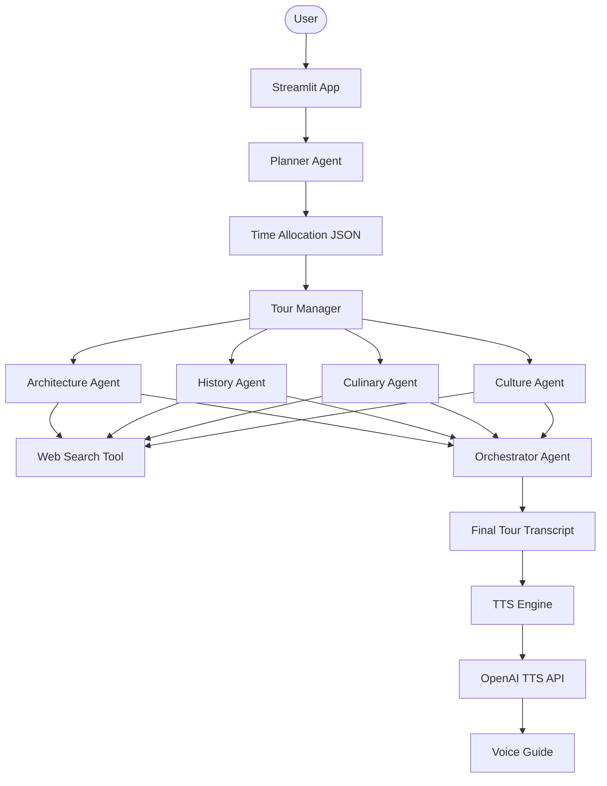

# 🎧 AI Audio Tour Agent with OpenAI Agents SDK

A professional-grade, multi-agent audio tour guide that researches any location and generates a high-quality, narrated tour tailored to your specific interests and time constraints.

## 🌟 Features

- **Personalized Research**: Powered by specialized agents for Architecture, History, Culinary, and Culture.
- **Dynamic Orchestration**: Automatically allocates time based on your interests and selected tour duration.
- **Narrated Experience**: Generates natural, engaging audio using OpenAI TTS with voice style and speed controls.
- **Interactive Map Links**: Instantly jump from your tour to Google Maps for navigation.
- **Session Persistence**: Keeps track of your generated tours during a session.
- **Modular Design**: Clean, maintainable structure with specialized engines and utilities.

## 🏗️ Architecture



## 🛠️ Quick Start

1. **Clone & Install**:

   ```bash
   git clone https://github.com/hamzach9410/LLM-PROJECTS-PACK.git
   cd voice_ai_agents/ai_audio_tour_agent
   pip install -r requirements.txt
   ```

2. **Configure API Keys**:
   Create a `.env` file from the provided `.env.example` template:

   ```env
   OPENAI_API_KEY=your_key_here
   ```

3. **Run the App**:
   ```bash
   streamlit run app.py
   ```

## 📦 Project Structure

- `app.py`: Streamlit frontend and UI logic.
- `manager.py`: Core orchestration logic for the multi-agent system.
- `agent.py`: Definitions for specialist and orchestrator agents.
- `utils.py`: TTS narration engine and logging helpers.
- `config.py`: Centralized configuration and constants.

## 🚀 20 Contributions

This project has been upgraded with 20 professional contributions including full modularization, enhanced UI controls, error resilience, and interactive features.
