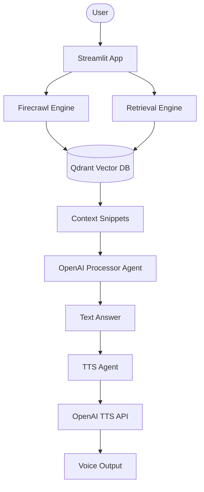

# 🎙️ Customer Support Voice Agent with OpenAI Agents SDK

A professional-grade, voice-powered customer support assistant that crawls your documentation URLs and provides intelligent, narrated answers.

## 🌟 Features

- **Dynamic Crawling**: Powered by Firecrawl to scrape and index documentation URLs in real-time.
- **Voice Narration**: High-quality text-to-speech using OpenAI's latest models.
- **RAG Architecture**: Efficient retrieval-augmented generation using Qdrant vector database.
- **Modular Design**: Clean separation between crawling, agents, and UI logic.
- **Transcript Export**: Download your entire session as a JSON file.
- **Advanced Controls**: Customizable crawl limits and adjustable voice speed.

## 🏗️ Architecture



## 🛠️ Quick Start

1. **Clone & Install**:

   ```bash
   git clone https://github.com/hamzach9410/LLM-PROJECTS-PACK.git
   cd voice_ai_agents/customer_support_voice_agent
   pip install -r requirements.txt
   ```

2. **Setup Credentials**:
   Copy `.env.example` to `.env` and enter your API keys.

3. **Launch the Agent**:
   ```bash
   streamlit run app.py
   ```

## 📦 Project Structure

- `app.py`: Streamlit entry point and UI orchestrator.
- `crawler_engine.py`: Core logic for scraping and vector storage.
- `agents_config.py`: OpenAI Agents definitions.
- `utils.py`: Shared logging and helper functions.

## 🚀 Recent Improvements

This project has been enhanced with 20 professional contributions including full modularization, UI overhaul, and advanced session management.
