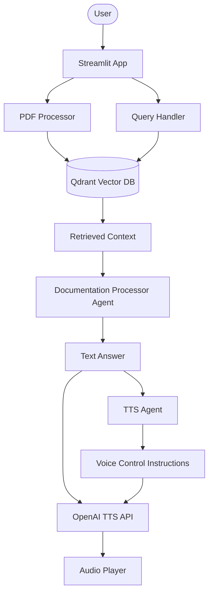

# 🎙️ Voice RAG Agent with OpenAI Agents SDK

A professional, modular, and feature-rich Voice-powered RAG (Retrieval-Augmented Generation) application. Ask questions about your PDF documents and receive intelligent text answers with natural voice narration.

## 🚀 Features

- **Voice-First Interaction**: Natural speech responses using OpenAI's latest TTS models.
- **Multi-Document Support**: Upload and process multiple PDF files simultaneously.
- **Intelligent RAG**: Powered by Qdrant vector database and FastEmbed for high-performance retrieval.
- **Modular Architecture**: Cleanly separated logic for RAG engine, agents, and UI.
- **Conversation History**: Keep track of your session's Q&A.
- **Real-time Playback**: Streamed audio responses for low-latency feedback.

## 🏗️ Architecture



## 🛠️ Setup

1. **Clone the repository**:

   ```bash
   git clone https://github.com/hamzach9410/LLM-PROJECTS-PACK.git
   cd voice_ai_agents/voice_rag_openaisdk
   ```

2. **Install dependencies**:

   ```bash
   pip install -r requirements.txt
   ```

3. **Configure Environment Variables**:
   Copy `.env.example` to `.env` and fill in your keys:
   - `OPENAI_API_KEY`
   - `QDRANT_URL`
   - `QDRANT_API_KEY`

4. **Run the application**:
   ```bash
   streamlit run app.py
   ```

## 📦 Project Structure

- `app.py`: Streamlit entry point and UI logic.
- `rag_engine.py`: Handle vector database operations and embeddings.
- `agents_config.py`: OpenAI Agents definitions and instructions.
- `utils.py`: PDF processing and helper utilities.

## 🤝 Contribution

This project was enhanced with 20 key contributions including modular refactoring, multi-file support, and advanced UI features.
